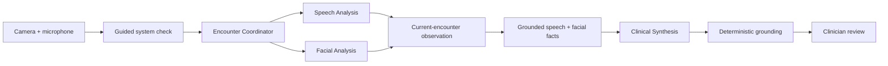

# Neurotrax

Neurotrax is an ambient audiovisual assessment experience for telehealth
encounters. It transforms ephemeral camera and microphone signals into
structured, reviewable measurements without retaining audio or video.

> **Demonstration use only. Not for clinical decisions.**

## Two focused capabilities

### Ambient audiovisual assessment

The encounter coordinator independently curates technically usable speech and
facial windows. Each analysis lane may withhold measurement when its own
quality requirements are not met, while the other lane continues operating.

The guided demonstration makes that independence visible:

1. establish usable speech and facial signals;
2. briefly turn away while continuing to speak;
3. observe facial measurement pause while speech continues;
4. return to the camera and observe automatic recovery.

### Clinician encounter summary

After capture, Neurotrax produces one structured speech fact and one structured
facial fact. Clinical Synthesis drafts a concise encounter summary from those
facts, and a deterministic grounding layer verifies every displayed statement
before it reaches clinician review.

Selecting a statement opens its complete trace:

```text
statement → measurement → window → quality conditions → workflow events
```

The workflow ends with an explicit human decision to approve or dismiss the
summary.

## Demo flow

1. Confirm consent.
2. Run the system check.
3. Remain quiet briefly while room conditions are calibrated.
4. Speak for several seconds while facial framing is verified.
5. Begin the assessment and follow the four on-screen cues.
6. Complete the assessment once every milestone is satisfied.
7. Inspect the measured signals and grounding traces.
8. Approve or dismiss the encounter summary.

The complete live sequence is designed to finish in approximately 20–30
seconds after the system check.

## Privacy design

- Capture requires explicit consent.
- Camera and microphone signals are processed only during the active session.
- Audio, video, screenshots, and transcripts are not retained.
- Only bounded signal primitives, quality facts, measurements, and workflow
  events reach the summary layer.
- Camera and microphone access is released immediately after capture.
- The application is intended only for the presenter’s non-patient
  demonstration data.

## Architecture



The speech and facial analysis loops are deterministic. Clinical
Synthesis cannot create measurements, change quality decisions, or select
unsupported evidence.

## Local development

Requirements:

- Node.js 22 or newer
- pnpm 9.12.3
- Chrome
- a Mac with a camera and microphone
- completion of the local operator configuration

```bash
pnpm install
pnpm dev
```

Open [http://127.0.0.1:4173](http://127.0.0.1:4173).

Operator configuration and troubleshooting are documented in
[`docs/operator-guide.md`](docs/operator-guide.md).

## Validation

```bash
pnpm test:unit
pnpm typecheck
pnpm build
pnpm test:browser
pnpm test
```

The browser suite verifies the complete guided workflow, including
modality-specific withholding, facial recovery, two grounded encounter
statements, evidence tracing, and both review decisions.

## Repository map

```text
apps/capture-web/       Live camera, microphone, guided UI, and summary endpoint
packages/contracts/     Shared observations, calibration, events, and evidence
packages/ambient-core/  Deterministic windowing and signal extraction
packages/evidence-core/ Current-encounter fact creation and grounding
docs/                   Architecture, safety, validation, and operator guidance
```
