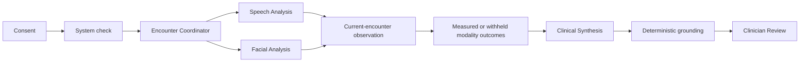

# Neurotrax

**Ambient audiovisual assessment for telehealth neurological care**

## About

Neurotrax is an agentic AI system designed to make telehealth encounters a
richer source of structured information about neurological function. It is team of 
specialized subagents that analyze patient speech patterns, facial movements,
and other other biomarkers of neurological health to screen for and monitor 
signs of neurological health.

Instead of treating video visits only as conversations, it coordinates independent
speech and facial analysis agents that identify technically usable moments,
measure bounded audiovisual features, abstain when signal quality is poor, and
assemble the resulting evidence for clinician review.

The system uses the camera and microphone already present on a laptop. It
processes audiovisual signals while the encounter is happening, releases the
devices when capture ends, and produces a concise encounter summary with a
trace back to every supporting measurement. Audio and video are not recorded
or retained, and no AI component is permitted to make a diagnosis or take an
autonomous clinical action.

Neurotrax demonstrates how carefully bounded AI agents can turn routine care
into a more measurable workflow while preserving provenance, uncertainty,
privacy, and human oversight.

> **Demonstration use only. Not for clinical decisions.**

## Why we built it

Telehealth is excellent at connecting a clinician and patient, but most video
visits still function mainly as conversations. The camera and microphone carry
additional information—speech timing, vocal variation, facial movement,
framing, pose, and signal quality—that is usually observed informally and then
lost when the visit ends.

That is especially important in neurological and neurodegenerative care, where
change can be gradual and difficult to recognize from memory alone. A short
appointment may contain useful functional signals, but clinicians have limited
time to measure them manually, document them consistently, and compare them
across many encounters.

Neurotrax explores a different model:

- collect structured audiovisual measurements during the visit;
- separate usable signal from poor-quality signal;
- preserve the evidence behind every reported observation;
- summarize the encounter without making a diagnosis; and
- keep a clinician in control of the final result.

The current system focuses on one encounter at a time. A future version could
trend validated measurements across genuine prior visits, creating a more
objective view of change over time without requiring a separate testing
session.

## What Neurotrax does

Neurotrax has two focused capabilities.

### 1. Ambient audiovisual assessment

After consent, the application runs a short system check to calibrate the
participant’s environment, voice, facial position, and lighting. During the
assessment, speech and facial signals are evaluated independently.

The system check ends after five seconds, and the encounter follows a fixed
fourteen-second sequence. Signal quality determines whether an agent measures
or abstains; it never determines whether the workflow is allowed to finish.

If the participant briefly turns away, Facial Analysis stops producing
measurements rather than inventing a value. Speech Analysis can continue
operating at the same time. When the participant returns to an acceptable
position, facial measurement resumes automatically.

This independent **measure, withhold, and recover** behavior is central to the
system: missing or unreliable information should be visible, not silently
converted into false precision.

### 2. EHR-ready encounter report

At the end of the encounter, Neurotrax creates exactly one acquisition outcome
for speech and one for facial analysis. Clinical Synthesis includes only
successfully measured metrics in a short, copyable encounter report. A
modality without a usable metric is omitted from the clinical narrative rather
than described as a finding.

Before anything is displayed, a grounding layer checks that:

- each statement refers to a real current-encounter measurement or abstention;
- the supporting accepted or withheld window exists;
- relevant quality conditions are preserved;
- no unsupported number or clinical conclusion was added; and
- one statement is supported by each modality.

The clinician can inspect either statement, review its evidence trace, and then
**Approve summary** or **Dismiss** it. The workflow is not complete until a
human makes that decision.

## Where AI agents are involved

Neurotrax uses a small team of bounded agents rather than one system making
every decision. Each agent has a specific responsibility, its own quality
rules, and an auditable output.

| Workflow role | What it does | What it produces |
| --- | --- | --- |
| **Encounter Coordinator** | Runs the timed workflow, coordinates parallel analysis, opens and closes measurement windows, and advances on schedule while recording whether each target moment was confirmed. | A structured current-encounter observation and auditable decisions. |
| **Speech Analysis** | Detects technically usable speech and measures features such as voiced-time fraction, bounded pauses, and pitch variability. | Speech measurements or an explicit abstention. |
| **Facial Analysis** | Evaluates visibility, position, pose, illumination, frame rate, and facial movement. It withholds output when quality is inadequate and resumes after recovery. | Facial measurements or an explicit abstention. |
| **Clinical Synthesis** | Converts successfully measured speech and facial metrics into concise, generalist-readable language without changing the underlying evidence. | A copyable, EHR-ready encounter report. |
| **Clinician Review** | Gives a person the final decision over whether the summary should be used for the session. | An approval or dismissal event. |

The agents communicate through structured events rather than hidden narrative
about what they are “thinking.” This makes the workflow observable while
keeping the displayed activity tied to actions the system actually performed.

## The encounter workflow



In the live experience:

1. The participant provides consent.
2. Neurotrax requests camera and microphone access.
3. The system measures quiet-room conditions.
4. The participant speaks while facial framing and lighting are assessed.
5. After no more than five seconds, the system labels each calibration as
   strong, limited, or unavailable and enables the assessment.
6. Speech and facial agents establish independent usable windows.
7. The participant briefly turns away while continuing to speak.
8. Facial Analysis visibly withholds measurement while Speech Analysis
   continues.
9. The participant returns, and Facial Analysis confirms recovery.
10. Neurotrax closes capture automatically after fourteen seconds and begins
    preparing the summary in the background.
11. Two grounded encounter statements are available immediately while a short
    clinician-readable narrative is synthesized.
12. The results workspace opens automatically; the clinician inspects the
    evidence, can copy the formatted report into an authorized documentation
    workflow, and approves or dismisses it.
13. Approval establishes today as Visit 1 and shows how future routine visits
    could form a within-patient trajectory without inventing prior history.

The system check and guided assessment complete in approximately nineteen
seconds. Narrative availability cannot delay access to the two grounded
modality outcomes.

## How this could make care better, faster, and less expensive

Neurotrax is not yet clinically validated, so these are intended design
benefits rather than claims of demonstrated clinical performance.

### Better

- **More consistent observation:** the same quality rules can be applied at
  each encounter instead of relying only on memory or informal impressions.
- **Visible uncertainty:** poor framing, excessive head rotation, low light,
  and unusable speech can cause an explicit abstention instead of a misleading
  measurement.
- **Evidence-backed summaries:** every displayed statement can be traced to a
  measurement, time window, quality conditions, and originating workflow
  events.
- **Human oversight:** the system drafts and verifies; a clinician decides.
- **Potential longitudinal value:** repeated validated measurements could make
  subtle functional change easier to recognize across visits.

### Faster

- **Assessment during ordinary care:** signals are collected while the
  telehealth encounter is already happening.
- **Automatic measurement preparation:** usable windows and quality conditions
  are organized without requiring a clinician to review the full encounter
  manually.
- **Concise handoff:** the clinician receives two bounded statements rather
  than an unstructured stream of technical output.
- **Immediate evidence:** measured or withheld modality outcomes appear as soon
  as capture ends, without waiting for narrative synthesis.
- **Faster verification:** selecting a statement opens its supporting evidence
  immediately.

### Less expensive

- **Existing hardware:** the design uses a standard laptop camera and
  microphone rather than specialized sensing equipment.
- **Remote availability:** repeatable observations could be collected without
  requiring every check to occur in a specialty center.
- **Lower documentation burden:** structured measurements and summaries may
  reduce repetitive manual preparation.
- **Focused clinician attention:** automation handles signal curation and
  evidence assembly while preserving the clinician’s role in interpretation
  and action.

## What the system measures—and what it does not

The current assessment derives bounded speech and facial measurements,
including:

- voiced-time fraction;
- pauses within a defined duration range;
- pitch variability;
- facial movement;
- blink-rate proxy;
- brow-movement amplitude; and
- technical context such as signal quality, illumination, pose, and frame
  rate.

These measurements are exploratory engineering outputs. Neurotrax does not:

- diagnose a neurological condition;
- determine whether a person is improving or declining;
- recommend treatment or medication changes;
- infer emotion, intent, truthfulness, cognition, or decision-making capacity;
- interpret the content of the conversation;
- contact a patient or alter clinical records; or
- take an autonomous clinical action.

## Privacy and safety by design

- Explicit consent is required before device access or analysis.
- Audio and video are processed only during the active encounter.
- No recordings, screenshots, clips, or transcripts are retained.
- Raw camera frames and microphone samples are never sent to Clinical
  Synthesis.
- Only structured measurements, quality facts, and evidence references reach
  the summary stage.
- Camera and microphone access is released when capture ends.
- Unusable intervals produce abstentions rather than fabricated values.
- The clinician remains the final reviewer.

## Evidence traceability

Every summary statement can be followed back through the system:

```text
agent decision
  → accepted or withheld window
  → measurement or abstention
  → quality conditions
  → grounded statement
```

This trace separates three responsibilities that should not be collapsed:

1. measuring a signal;
2. describing what was measured; and
3. deciding what, if anything, to do clinically.

“EHR-ready” means the report is formatted for clinician-reviewed copy or
export. This demonstration does not connect to or write into an electronic
health record.

## Running Neurotrax locally

Requirements:

- Node.js 22 or newer
- pnpm 9.12.3
- Chrome
- a Mac with a camera and microphone
- completion of the local operator configuration

```bash
pnpm install
pnpm dev
```

Open [http://127.0.0.1:4173](http://127.0.0.1:4173).

Operator configuration and troubleshooting are documented in
[`docs/operator-guide.md`](docs/operator-guide.md).

## Validation

```bash
pnpm test:unit
pnpm typecheck
pnpm build
pnpm test:browser
pnpm demo:smoke
pnpm test
```

Automated coverage includes audiovisual calibration, speech detection, room-hum
rejection, facial quality failures, modality-specific withholding, recovery,
measurement confidence, grounded summary generation, evidence tracing, and
both human review decisions.

## Repository map

```text
apps/capture-web/       Live audiovisual capture, guided interface, and summary service
packages/contracts/     Shared calibration, observation, event, and evidence contracts
packages/ambient-core/  Deterministic signal windowing and measurement extraction
packages/evidence-core/ Current-encounter fact creation and grounding
docs/                   Architecture, safety, validation, and operator guidance
```
