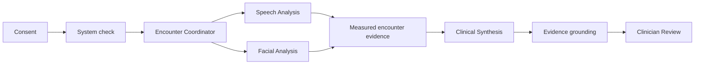

# Neurotrax

**Ambient audiovisual assessment for telehealth neurological care**

## About

Neurotrax turns an ordinary telehealth encounter into a structured source of
information about speech and facial function. It coordinates a small team of AI
agents that observe different signal streams, select useful measurement
windows, calculate bounded audiovisual metrics, assemble the supporting
evidence, and prepare a concise report for clinician review.

The experience uses the camera and microphone already built into a laptop. Raw
audio and video are processed only during the encounter: Neurotrax does not
record the visit, retain screenshots or clips, create a transcript, or send raw
media to the reporting stage.

The goal is simple: make routine remote care more measurable without adding
special hardware, a separate testing appointment, or another long workflow for
the clinician.

> **Demonstration use only. Not for clinical decisions.**

## Why we built it

Video visits are rich in information, but most of that information is observed
informally and disappears when the call ends. A participant's vocal variation,
speaking patterns, facial movement, head position, and other observable
features may all contribute useful context to a neurological evaluation.

This matters in neurological and neurodegenerative care because functional
change can be gradual. A clinician may see a patient only occasionally, and
subtle change can be difficult to recognize from memory or narrative notes
alone.

Neurotrax explores a care model in which routine telehealth encounters can
produce consistent, structured observations:

- audiovisual features are measured during the visit;
- each reported metric retains its supporting evidence;
- a concise encounter report is prepared automatically;
- a clinician approves or dismisses the final summary; and
- future visits can build a patient-specific trajectory over time.

The result is not a diagnosis. It is a better-organized observation layer that
can support clinician judgment.

## The two core capabilities

### 1. Ambient audiovisual assessment

After consent, Neurotrax checks the participant's environment and prepares the
camera and microphone. During the assessment, Speech Analysis and Facial
Analysis operate independently.

Speech Analysis identifies useful speech intervals and calculates features
related to speech initiation, continuity, pausing, and vocal modulation.
Facial Analysis evaluates facial visibility, position, pose, illumination, and
movement before calculating facial motor features from normalized landmark
relationships.

The two paths remain independent. When the participant turns away, the facial
path can pause while speech analysis continues. When the participant returns,
the facial path reconnects automatically. This is an important safety pattern:
one signal should never block the rest of the encounter or cause the system to
invent a value.

### 2. Clinician encounter report

When capture ends, Neurotrax routes the measured speech and facial metrics to
Clinical Synthesis. The resulting **Clinician Encounter Summary** contains:

- a short, generalist-readable narrative;
- a quantitative profile spanning speech timing, voice, and facial movement;
- a trace from each statement to its measurement window and quality context;
- a copyable format for clinician-reviewed EHR documentation; and
- explicit **Approve summary** and **Dismiss** actions.

Only captured metrics are shown in the presentation report. Technical
acquisition details remain available in operator diagnostics, not in the
clinician-facing summary.

## How AI agents work together

Neurotrax uses specialized agents with narrow responsibilities instead of
asking one general system to control the entire encounter.

| Agent | Responsibility | Observable output |
| --- | --- | --- |
| **Encounter Coordinator** | Orchestrates the encounter, starts parallel analysis, routes evidence, and keeps the workflow moving. | Agent events and a structured encounter observation. |
| **Speech Analysis** | Selects useful speech windows and calculates bounded vocal metrics. | Speech measurements with quality context and provenance. |
| **Facial Analysis** | Selects useful facial windows, pauses when the participant turns away, and reconnects on return. | Facial measurements with quality context and provenance. |
| **Clinical Synthesis** | Converts measured outputs into concise clinical documentation without changing the underlying evidence. | A grounded, EHR-ready encounter summary. |
| **Clinician Review** | Keeps a person in control of the final deliverable. | An approval or dismissal event. |

The live interface is driven by real workflow events. When an analysis path
opens a window, pauses, reconnects, routes a metric, completes grounding, or
enters review, the corresponding node changes state. The interface does not
display invented internal monologues or hidden reasoning.



## What a viewer sees

1. The participant consents and starts the system check.
2. The Encounter Coordinator activates Speech Analysis and Facial Analysis in
   parallel.
3. As the participant speaks, accepted evidence packets move through the live
   agent graph.
4. The participant briefly turns away while continuing to speak.
5. Facial Analysis pauses while Speech Analysis remains active.
6. The participant returns; Facial Analysis reconnects and completes its next
   measurement window.
7. The Coordinator routes the measured metrics to Clinical Synthesis.
8. A clinician-ready report opens automatically.
9. Selecting a metric reveals its evidence chain.
10. The clinician approves or dismisses the summary.

Approval establishes the current encounter as Visit 1. Empty future-visit
positions illustrate how repeated routine encounters could eventually form a
within-patient trajectory—without presenting invented prior patient data.

## Potential impact

### Better care

- **More consistent observation:** the same measurement and quality policies
  can be applied at each encounter.
- **Evidence-backed documentation:** every displayed metric can be traced to a
  measurement window, quality conditions, and originating agent events.
- **Independent signal handling:** one analysis path can pause without
  disrupting the other.
- **Human oversight:** agents measure, organize, and draft; a clinician decides.
- **Longitudinal potential:** repeated measurements could help clinicians
  recognize subtle within-patient change across visits.

### Faster care

- **Assessment during ordinary telehealth:** signal collection occurs during
  the encounter that is already happening.
- **Automatic evidence curation:** agents organize measurement windows and
  provenance without requiring manual review of an entire recording.
- **Immediate structured output:** measured metrics are ready as capture ends
  while the concise narrative is assembled.
- **Rapid verification:** selecting any report statement opens its supporting
  evidence chain.

### More accessible and potentially less expensive care

- **Existing hardware:** a standard laptop camera and microphone become the
  sensing layer.
- **Remote reach:** structured observations can be collected without requiring
  every check to occur at a specialty center.
- **Reduced preparation burden:** measurements and documentation are organized
  before clinician review.
- **Focused clinician time:** automation handles signal curation and evidence
  assembly while the clinician retains control of interpretation and action.

## Measurement scope

The current system derives ten encounter-level features from accepted
measurement windows:

- **speech timing and fluency components:** speech initiation latency,
  voiced-time fraction, and pauses within a defined duration range;
- **voice modulation:** pitch center and pitch variability;
- **facial motor function:** overall facial movement, blink-rate proxy, brow
  excursion, mouth-aperture range, and eye-aperture range; and
- **measurement context:** signal quality, illumination, pose, framing, and
  frame rate.

These are functionally relevant digital features, not diagnostic scores or
clinically validated endpoints. Neurotrax reports the measured values and their
provenance so a clinician can review them in context.

Neurotrax does not interpret the content of the conversation, infer emotion or
intent, diagnose a condition, recommend treatment, contact a patient, or alter
a clinical record autonomously.

## Privacy and safety

- Device access requires explicit consent.
- Audio and video are processed only during the active encounter.
- No recording, screenshot, clip, or transcript is retained.
- Raw media never reaches Clinical Synthesis.
- Only structured measurements, quality facts, and evidence references enter
  the report workflow.
- Camera and microphone access is released when capture ends.
- The clinician remains the final reviewer.

## Evidence traceability

Every displayed metric follows the same chain:

```text
agent decision
  → accepted measurement window
  → audiovisual metric
  → quality conditions
  → grounded report statement
```

“EHR-ready” means the report is formatted for clinician-reviewed copy or
export. This demonstration does not connect to or write into an electronic
health record.

## Run locally

Requirements:

- Node.js 22 or newer
- pnpm 9.12.3
- Chrome
- a Mac with a camera and microphone
- completion of the local operator configuration

```bash
pnpm install
pnpm dev
```

Open [http://127.0.0.1:4173](http://127.0.0.1:4173).

Configuration and troubleshooting are documented in
[`docs/operator-guide.md`](docs/operator-guide.md).

## Validate

```bash
pnpm test:unit
pnpm typecheck
pnpm build
pnpm test:browser
pnpm demo:smoke
pnpm test
```

## Repository map

```text
apps/capture-web/       Live audiovisual capture, agent interface, and summary service
packages/contracts/     Shared observation, event, and evidence contracts
packages/ambient-core/  Signal windowing and measurement extraction
packages/evidence-core/ Current-encounter fact creation and grounding
docs/                   Architecture, safety, validation, and operator guidance
```
