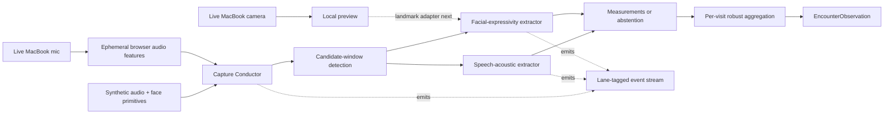

# Neurotrax

**A demo-first agentic audiovisual sidecar for longitudinal tele-neurology.**

Neurotrax is a research and hackathon prototype for turning measurable moments
inside routine telehealth encounters into structured, inspectable observations.
The intended live system uses a MacBook Pro camera and microphone as a stand-in
for a patient's future telehealth device.

Built for a future-of-agentic-AI-in-healthcare hackathon on **July 18, 2026**.

> **Research prototype only.** Not a medical device. Not for diagnosis,
> treatment, emergency detection, or use with protected health information.
> All current measurements are engineering placeholders with no clinical
> validation.

## Demo thesis

> **Telehealth has eyes and ears, but little longitudinal memory. Neurotrax
> turns measurable moments in an encounter into evidence a clinician can
> inspect over time.**

The clinician should be able to focus on the patient while a small team of
bounded processing agents works quietly in the background:

1. a Capture Conductor finds candidate windows that may be measurable;
2. independent speech and facial-signal extractors measure or abstain;
3. deterministic aggregation creates one versioned observation for the visit;
4. later capabilities compare compatible visits and assemble the supporting
   evidence for clinician review.

Raw conversation content is not interpreted. An unmeasurable interval produces
no invented value. The language model stays outside the measurement loop.

## What is implemented today

The repository contains two runnable layers:

1. a deterministic **headless ambient capture core** that replays synthetic
   derived audio and face primitives; and
2. a minimal **live MacBook browser adapter** that requests explicit consent,
   opens the self-facing camera and microphone, displays the live preview,
   computes ephemeral audio features in the browser, and hands them to the
   Capture Conductor when the encounter ends.

The current system produces:

- candidate speech measurement windows from live or fixture audio features;
- placeholder acoustic measurements and honest no-value outcomes;
- synthetic facial measurements and facial-quality abstentions in fixture
  replay only;
- robust per-visit aggregates using median and median absolute deviation;
- a monotonic, ordered event trace tagged by processing lane; and
- an `EncounterObservation` preserving windows, confounds, per-window
  measurements, aggregates, and abstentions.

No raw microphone or camera media is recorded, uploaded, or persisted by the
live adapter.

### Not implemented yet

The current code does **not** yet:

- compute face landmarks or facial measurements from the live camera;
- stream Conductor events incrementally during an encounter;
- provide a telehealth call;
- retain or promote evidence clips;
- store or trend observations across visits;
- generate a clinician evidence card; or
- diagnose, classify, predict, or recommend clinical action.

Those are explicit follow-up slices, not hidden or mocked capabilities.

## The entire product

Neurotrax intentionally has exactly three product capabilities.

### 1. Ambient Capture

During a consented telehealth encounter, the system analyzes the live
audiovisual stream ephemerally, identifies technically usable windows, and
extracts versioned measurements from natural conversation without prompting or
interrupting the patient.

Most of the timeline may be `not measurable`. The system curates useful windows
instead of coaching the participant to create them.

### 2. Personal Trajectory

The system compares each visit only with the same patient's compatible prior
visits. Compatibility will require:

- the same detected measurement context;
- capture confounds within a defined tolerance;
- compatible algorithm versions; and
- passing quality and clinician acceptance.

The result is provisional longitudinal evidence with uncertainty—not a
progression, diagnosis, or causal claim.

### 3. Clinician Evidence Card

The system assembles a concise review surface showing:

- what changed and what remained stable;
- quality, uncertainty, and comparability warnings;
- the structured measurements supporting each statement;
- source evidence when explicitly retained; and
- an `accepted` or `rejected` clinician decision.

Only clinician-accepted observations may enter longitudinal history.

## Current ambient-core architecture

The processing units below are internal lanes inside Capability #1. They are
not additional product capabilities or autonomous clinical actors.



The live browser path currently operates as:

```text
consented MacBook camera + microphone
  -> live local camera preview
  -> ephemeral Web Audio RMS, voice activity, SNR, clipping, and pitch features
  -> Capture Conductor after the encounter ends
  -> candidate measurement windows
  -> speech-acoustic extractor
  -> per-visit aggregate + abstentions + agent events
  -> structured observation displayed in the browser
```

### Why this is agentic

The agentic behavior is bounded and externally inspectable:

- **Observe:** detect when a modality has a candidate measurement window.
- **Decide:** select the matching extractor or abstain under its quality
  contract.
- **Act:** emit a structured measurement or abstention event.
- **Reconcile:** aggregate independent results onto one encounter timeline.
- **Deliver:** create the versioned per-visit observation.

Every visible activity must derive from a real structured event. Neurotrax
never displays private chain-of-thought, invented progress, or simulated agent
conversation.

## Quick start

### Prerequisites

- Node.js 22 or newer
- pnpm 9.12.3

### Install and validate

```bash
git clone https://github.com/logannye/neurotrax.git
cd neurotrax
corepack enable
pnpm install --frozen-lockfile
pnpm test
```

`pnpm test` runs:

1. the repository structure and safety-fixture validator;
2. the browser audio-feature and ambient-core replay tests;
3. TypeScript typechecking; and
4. the production browser build.

### Launch the live MacBook demo

```bash
pnpm dev
```

Open `http://127.0.0.1:4173`, check the self-demo consent box, and choose
**Begin live encounter**. Allow camera and microphone access when the browser
asks. Speak naturally for 8–12 seconds, then choose **End & analyze**.

The app releases the camera and microphone before rendering the structured
observation. If the browser or macOS blocks access, enable camera and
microphone permission for the browser and reload the page.

To run only the headless end-to-end replay tests:

```bash
pnpm --filter @neurotrax/ambient-core exec vitest run \
  src/conductor.test.ts --reporter verbose
```

### What the first replay does

The synthetic fixture contains about two seconds of audio-feature and
face-landmark frames. `runConductor()`:

1. detects candidate speech and face windows;
2. routes each window to its deterministic extractor;
3. records placeholder measurements or a reason-coded abstention;
4. aggregates the visit by biomarker; and
5. emits a lane-tagged event trace ending in
   `encounter-observation.created`.

The replay test also degrades face framing to prove that the facial lane
abstains instead of fabricating a result, while the independently measurable
speech lane can continue.

Identical input and base time produce byte-identical output.

## Measurement posture

The current values are deliberately named with a `prototype.*` code and carry:

```text
uncertainty: "placeholder"
clinicalValidation: "none"
algorithmVersion: "<extractor>-0.1"
```

They demonstrate infrastructure, not clinical biomarkers. Short-window speech
and facial proxies must not be presented as validated articulation, affect,
bradykinesia, hypomimia, disease status, medication response, or progression.

Measurement, interpretation, and clinical action remain separate:

```text
deterministic signal processing
  -> structured observation
  -> compatibility-aware longitudinal evidence
  -> grounded prose
  -> clinician interpretation and sign-off
```

## Privacy and safety model

- Analysis requires explicit, revocable consent.
- The intended live path is **continuous analysis, not continuous recording**.
- Raw audiovisual frames should be processed ephemerally and released.
- The live adapter releases its media tracks at the end of the encounter and
  persists no raw media.
- The core consumes derived primitives only.
- Short evidence snippets are a future, separately governed feature.
- Transcripts and media are untrusted data, never agent instructions.
- Quality failure returns `not measurable`.
- No language model creates, changes, or gates measurements.
- No component both recommends and executes a consequential clinical action.
- No PHI, recordings, credentials, or secrets belong in this repository.
- Current fixtures are synthetic and set `containsPHI: false`.

## Demo vision

The eventual hackathon experience is one camera-dominant screen:

```text
live consented encounter
  -> subtle multi-lane agent activity
  -> truthful modality-specific abstention
  -> today's observation lands on a synthetic longitudinal timeline
  -> grounded evidence card assembles
  -> clinician traces a claim to measurement, event, and retained evidence
  -> clinician accepts or rejects
```

The signature visual moment is not a fake AI conversation. It is a truthful
split in agent behavior: for example, the participant moves partially out of
frame, the facial lane visibly abstains when its framing gate fails, and the
speech lane continues only if its own quality contract still passes.

The current camera and microphone session can now be genuinely live. Prior
history and the live facial lane remain future work.

## Implementation roadmap

The next three slices preserve the same three-capability product:

1. **Complete live ambient capture:** add local face landmarks, facial
   primitives, and incremental Conductor event emission.
2. **Longitudinal store and compatibility:** persist accepted per-visit
   observations and compare only matching context, confounds, and algorithm
   versions.
3. **Demo interface:** render the live camera, multi-lane flight recorder,
   longitudinal reveal, evidence card, claim traceability, and clinician
   accept/reject.

No new extractor modality or fourth product capability should be added until
this loop works beautifully end to end.

## Repository map

```text
neurotrax/
├── apps/
│   ├── capture-web/             # Runnable MacBook camera/mic demo
│   └── clinician-review/        # Partial legacy brief; ambient re-key pending
├── agents/
│   ├── guided-capture/          # Legacy capability notes; ambient design supersedes the script
│   ├── personal-trajectory/     # Legacy prompt-version logic; ambient re-key pending
│   └── evidence-card/           # Evidence boundary; ambient inputs pending
├── packages/
│   ├── ambient-core/            # Deterministic measurement pipeline
│   ├── contracts/               # Shared ambient measurement contracts
│   └── event-log/               # Legacy/demo event-log documentation
├── docs/
│   ├── superpowers/specs/       # Current ambient Capability #1 design
│   ├── superpowers/plans/       # Executed core implementation plan
│   ├── architecture.md          # Earlier scripted demo-spine architecture
│   ├── demo-experience.md       # Earlier scripted demo choreography
│   ├── safety.md
│   └── validation.md
├── examples/                    # Synthetic legacy/demo examples
├── protocols/                   # Earlier task-bound protocol
└── scripts/                     # Structure and safety validation
```

The authoritative ambient design is
[docs/superpowers/specs/2026-07-18-ambient-biomarker-capture-design.md](docs/superpowers/specs/2026-07-18-ambient-biomarker-capture-design.md).
The implemented plan is
[docs/superpowers/plans/2026-07-18-ambient-capture-core.md](docs/superpowers/plans/2026-07-18-ambient-capture-core.md).

## Explicit non-goals

The first product does not include:

- diagnosis or disease classification;
- medication recommendations or autonomous actions;
- emergency or respiratory-risk prediction;
- conversation-content interpretation;
- continuous raw-media recording;
- EHR integration;
- a large agent mesh;
- a neurological foundation model;
- a general-purpose digital twin; or
- automated patient alerts.

## Evidence-informed, not clinically validated

The concept is informed by research on:

- [webcam-based Parkinson's finger-tapping assessment](https://www.nature.com/articles/s41746-023-00905-9);
- [remote ALS speech monitoring](https://www.nature.com/articles/s41746-020-00335-x);
- [digital speech response to levodopa](https://www.nature.com/articles/s41531-025-01045-5);
- [limitations of remote MDS-UPDRS assessment](https://pmc.ncbi.nlm.nih.gov/articles/PMC9391277/); and
- [FDA remote digital-health guidance](https://www.fda.gov/regulatory-information/search-fda-guidance-documents/digital-health-technologies-remote-data-acquisition-clinical-investigations).

These sources do not validate Neurotrax or authorize clinical use.

## Contributing

Read [CONTRIBUTING.md](CONTRIBUTING.md) and [AGENTS.md](AGENTS.md). Changes
should strengthen one of the three product capabilities or a required safety
foundation. Otherwise, defer them.

## License

[MIT](LICENSE)
