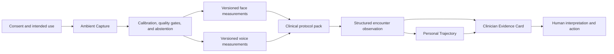

# PhenoMetric

**A clinical observability layer for telehealth**

PhenoMetric is a research prototype for turning consented face and voice signals
from an ordinary remote encounter into quality-controlled, traceable, and
longitudinal clinical observations.

The name combines **phenotype**—the observable expression of health and
disease—with **metric**—a bounded, reproducible measurement. PhenoMetric began
as NeuroTrax, a neurological hackathon demonstration. The platform vision is
broader: a reusable audiovisual measurement system that can support carefully
validated screening, assessment, monitoring, trending, and treatment-response
workflows across medical specialties.

> **Current status: research and engineering prototype. Not a medical device.
> Not for clinical decisions.**

## The thesis

Telehealth made the clinical conversation remote, but much of the observable
examination remains informal. Speech timing, vocal function, facial symmetry,
eyelid movement, oral aperture, articulatory coordination, respiratory effort,
and other visible or audible features may be noticed during a visit but are
rarely measured consistently. Most disappear when the call ends.

PhenoMetric explores a different care model:

1. use the camera and microphone already present in a telehealth encounter;
2. identify technically valid moments without assuming every moment is usable;
3. calculate bounded, versioned face and voice measurements;
4. retain structured measurements and provenance instead of raw media;
5. compare compatible observations with the patient's own prior baseline; and
6. present the result as inspectable evidence for a clinician to accept or
   dismiss.

The goal is not to create an autonomous doctor that diagnoses a person from
their face or voice. The goal is to add instrumentation to remote care: make
selected parts of the observable phenotype measurable, comparable, and
reviewable.

## Why this could matter for patient care

Routine care is episodic. Many clinically relevant changes are gradual,
fluctuating, or treatment-dependent, and a specialist may see a patient only a
few times per year. A structured audiovisual observation layer could make
remote care:

- **more sensitive to change:** repeated measurements can reveal a deviation
  from a patient's own baseline that is difficult to recognize from memory;
- **more consistent:** the same acquisition, quality, and calculation policy
  can be applied across encounters;
- **more accessible:** a standard laptop or phone can extend structured
  assessment beyond specialty centers;
- **more efficient:** evidence can be curated and documented while the
  clinician remains responsible for interpretation and action;
- **more inspectable:** every reported value can retain its source interval,
  quality conditions, algorithm version, and review history; and
- **more useful for research:** repeated remote measures may support
  decentralized studies and treatment-response endpoints.

The strongest near-term opportunity is usually longitudinal measurement in a
patient with a known condition, not stand-alone population diagnosis.

## The three product capabilities

The platform has exactly three product capabilities. New clinical applications
should be implemented as validated protocol packs within these capabilities,
not as additional autonomous product layers.

### 1. Ambient Capture

Ambient Capture coordinates consent, device access, calibration, signal
quality, measurement windows, and independent face and voice analysis.

It supports two complementary modes:

- **ambient observation** during natural conversation; and
- **brief prompted microtasks** when a standardized context is necessary, such
  as smiling, sustained gaze, eye closure, counting, reading, repeated
  syllables, or sustained phonation.

Each modality remains independent. A face window can be withheld while voice
analysis continues, or a voice measurement can be omitted while technically
valid facial evidence remains available. An unusable interval produces
`not measurable`, not an invented value.

### 2. Personal Trajectory

Personal Trajectory compares a current observation only with compatible,
accepted measurements from the same person.

Compatibility depends on more than the metric name. It includes:

- measurement context and task;
- algorithm and protocol version;
- camera, microphone, and capture-adapter provenance;
- signal-to-noise, illumination, pose, framing, and frame rate;
- clinically relevant timing such as medication state or time of day; and
- condition-specific confound rules.

The intended output is a transparent within-patient trajectory with uncertainty
and exact inclusion or exclusion reasons. It is not a claim of disease
progression unless a specific context of use has been clinically validated and
approved.

### 3. Clinician Evidence Card

The Clinician Evidence Card turns structured measurements into a concise
review artifact without changing the underlying evidence.

It can contain:

- a quantitative encounter profile;
- current-versus-personal-baseline comparisons;
- acquisition quality and uncertainty;
- a trace from every statement to its source measurement;
- a copyable or interoperable clinical-documentation format; and
- an explicit clinician approval, correction, or dismissal decision.

Generative AI may help organize or phrase the report, but it does not create
measurements, select unsupported evidence, diagnose a condition, or execute a
clinical action.

## Platform model



A **clinical protocol pack** binds the shared platform to one narrow context of
use. It defines the target population, tasks, measurements, quality contract,
confounders, reference standard, validated thresholds, uncertainty model,
report language, and expected clinician workflow.

There should be no universal disease classifier. Facial palsy rehabilitation,
myasthenia monitoring, thyroid-eye measurement, laryngology follow-up, and
acromegaly referral enrichment require different tasks, models, evidence, and
regulatory claims even though they share a capture substrate.

See [`docs/telehealth-platform-vision.md`](docs/telehealth-platform-vision.md)
for the complete product, clinical, validation, and development roadmap.

## Clinical opportunity landscape

Face and voice analysis can be clinically relevant when a condition changes
facial morphology or movement, eyelid and ocular function, oral motor control,
phonation, articulation, respiratory support, language production, or the
coordination among those systems.

| Clinical area | Candidate observables | Most defensible initial use |
| --- | --- | --- |
| Facial nerve palsy and post-stroke rehabilitation | facial symmetry, smile excursion, eyelid closure, brow motion, dysarthria | objective grading and recovery tracking after a known event |
| Myasthenia gravis | ptosis, sustained-gaze fatigue, eye closure, facial weakness, counting and voice fatigue | repeated symptom and treatment-response monitoring |
| ALS and bulbar neuromuscular disease | articulation, phonation, pauses, intelligibility, lip and jaw movement, breath support | longitudinal bulbar-function measurement |
| Parkinsonism, Huntington disease, multiple sclerosis, and ataxia | facial movement, blinking, tremor-related motion, rhythm, articulation, prosody | known-disease monitoring and clinical-trial endpoints |
| Cognitive impairment and dementia | pauses, fluency, word retrieval, turn-taking, linguistic structure, facial dynamics | clinician-supported screening and repeated cognitive assessment |
| Laryngology and head-and-neck care | dysphonia, phonation stability, vocal breaks, articulation, lip and jaw rehabilitation | voice-function assessment, therapy response, and referral support |
| Thyroid eye disease and oculoplastics | eyelid retraction, ptosis, aperture, closure, blink, symmetry | remote measurement and postoperative monitoring |
| Acromegaly and selected endocrine disorders | craniofacial morphology, facial ratios, deepened voice, vocal-tract change | referral enrichment in an appropriate high-risk population |
| Systemic sclerosis and craniofacial rehabilitation | oral aperture, lip mobility, facial restriction, speech effects | microstomia and rehabilitation monitoring |
| Heart failure, asthma, and COPD | breath support, speech breathlessness, phonation change, cough acoustics | research-stage exacerbation or decompensation monitoring |
| Depression and bipolar disorder | speech quantity, pauses, prosody, head movement, facial mobility | explicitly consented symptom and treatment-response tracking |
| Pain, fatigue, and frailty | facial action units, guarded movement, vocal effort, speech strength and tempo | supplemental human-reviewed functional assessment |
| Autism and developmental conditions | gaze, prosody, facial-vocal coordination, social timing | specialist support during standardized assessment and therapy |
| Rare genetic syndromes | static facial morphology and developmental voice patterns | candidate prioritization for a clinical geneticist followed by molecular testing |

These are research and product-development directions, not claims supported by
the current prototype. Several areas have encouraging primary research:

- disease-specific facial landmarks can quantify facial palsy more reliably
  than models trained only on healthy faces
  ([JAMA Otolaryngology study](https://pubmed.ncbi.nlm.nih.gov/32053425/));
- remote voice and video tasks can capture fatigable signs relevant to
  myasthenia gravis
  ([BioDigit MG feasibility study](https://pmc.ncbi.nlm.nih.gov/articles/PMC12661141/));
- remote speech measures have tracked longitudinal change in ALS
  ([npj Digital Medicine study](https://www.nature.com/articles/s41746-020-00335-x));
- marker-free eyelid measurement has been evaluated for thyroid eye disease
  ([multicenter validation study](https://pmc.ncbi.nlm.nih.gov/articles/PMC13199772/));
- facial and voice models have independently shown promise for acromegaly
  referral enrichment
  ([facial study](https://pmc.ncbi.nlm.nih.gov/articles/PMC12838525/),
  [voice study](https://pmc.ncbi.nlm.nih.gov/articles/PMC11913075/)); and
- voice analysis can detect laryngeal abnormality more readily than it can
  distinguish malignant from benign disease
  ([laryngeal disease study](https://pubmed.ncbi.nlm.nih.gov/38654036/)).

Promising research is not deployment evidence. Every intended use still
requires technical verification, analytical validation, clinical validation in
the proposed population, usability testing, and workflow evaluation.

## Context-of-use ladder

The same measurement can support very different claims. Development should
advance deliberately through four levels:

1. **Measurement and documentation**

   Report what was measured, how, and under what quality conditions.
2. **Longitudinal monitoring**

   Compare the result with a compatible personal baseline and quantify change.
3. **Screening or decision support**

   Apply a prospectively validated threshold to support a clinician's next
   step.
4. **Diagnosis, triage, or treatment action**

   Make a condition or action claim with substantially higher evidence,
   regulatory, safety, and human-factors requirements.

The current prototype is at level 1 with an internal engineering foundation for
level 2. Most initial protocol packs should target levels 1 and 2.

FDA guidance similarly emphasizes that a remote digital health technology must
be fit for its specific purpose and validated for the proposed characteristic
and population
([FDA guidance](https://www.fda.gov/media/155022/download)).

## Current implementation

The working demonstration uses a laptop camera and microphone and implements:

- explicit consent and a bounded system check;
- quiet-room voice calibration and adaptive voice activity detection;
- local MediaPipe facial landmarks and blendshape proxies in a browser worker;
- independent, quality-gated speech and facial measurement windows;
- ten prototype encounter metrics;
- robust per-visit aggregation with algorithm-version checks;
- reason-coded abstention and append-only workflow events;
- a deterministic evidence layer with bounded server-side synthesis;
- a clinician-facing quantitative profile and provenance drawer; and
- explicit approval or dismissal.

The ten current features are:

- speech initiation latency;
- voiced-time fraction;
- bounded pause rate;
- pitch center and pitch variability;
- overall facial movement;
- blink-rate proxy;
- brow excursion;
- mouth-aperture range; and
- eye-aperture range.

They are engineering features, not validated biomarkers. Measurements
explicitly carry placeholder uncertainty and `clinicalValidation: "none"`.

The live demonstration still uses the original NeuroTrax 24-second
neurological presentation workflow as its first protocol-shaped example.
Personal Trajectory exists as a tested internal package but is not connected
to persistent patient history. No authentication, clinical data store, FHIR
integration, EHR write, or production deployment is implemented.

## Privacy, safety, and trust

The production direction is **ephemeral media, durable measurements**:

- request explicit, purpose-specific consent before analysis;
- process raw audio and video locally when technically feasible;
- retain the minimum structured measurements needed for the intended use;
- keep raw media and conversation content away from narrative generation;
- make device, context, quality, uncertainty, and algorithm version visible;
- permit every modality and measurement to abstain;
- separate measurement, interpretation, review, and action;
- prohibit covert emotion, truthfulness, intent, capacity, or pain-validity
  inference;
- prohibit autonomous diagnosis, treatment, emergency action, or patient
  communication without an independently approved and validated workflow; and
- require human review before clinical documentation or action.

Clinical development needs a separate, explicitly consented research
environment. Analytical and clinical validation may require encrypted,
access-controlled retention of source media for annotation and comparison with
reference standards. That research path must remain isolated from the
ephemeral production path and must never be silently enabled in the product.

See [`docs/safety.md`](docs/safety.md) for the enforced prototype boundary and
future deployment gates.

## Development roadmap

### Phase 0 — level the foundation

- align repository language around the general telehealth platform;
- preserve the three capability boundaries;
- remove or label stale hackathon fixtures and documentation;
- define a versioned protocol-pack contract; and
- make current limitations and validation state machine-readable.

### Phase 1 — strengthen the measurement engine

- add clinically meaningful facial geometry, laterality, symmetry, eyelid,
  gaze, lip, jaw, tremor, and fatigability measures;
- add robust phonation, spectral, articulation, intelligibility, respiratory,
  cough, and speaker-attribution features;
- support ambient windows and configurable prompted microtasks;
- improve device calibration and cross-device comparability;
- replace placeholder confidence with repeatability-based uncertainty; and
- connect Personal Trajectory to a privacy-preserving derived-measurement store.

### Phase 2 — build the validation platform

- create a separately governed research capture and annotation environment;
- collect repeated measures across devices, environments, demographics, and
  relevant disease severities;
- quantify test-retest reliability, missingness, subgroup performance, and
  failure modes;
- compare candidate measures with clinician ratings and accepted reference
  standards; and
- establish model, protocol, and dataset version governance.

### Phase 3 — validate one narrow protocol pack

Recommended candidates are:

1. facial palsy rehabilitation measurement;
2. myasthenia gravis face-and-voice monitoring;
3. laryngology voice-function follow-up; or
4. acromegaly referral-enrichment research.

Select one intended use, population, clinical workflow, and primary endpoint.
Do not combine claims merely because they share a sensor.

### Phase 4 — clinical workflow integration

- add identity, authorization, consent records, audit, and retention policy;
- implement clinician correction and adjudication;
- support FHIR-compatible observation and document export;
- integrate with telehealth and EHR workflows without autonomous writes;
- add operational monitoring, rollback, incident response, and cybersecurity;
  and
- complete regulatory and institutional review appropriate to the intended
  use.

### Phase 5 — expand the protocol portfolio

Reuse the verified capture, trajectory, evidence, and governance platform while
validating each new specialty pack independently. Shared infrastructure should
reduce engineering cost; it must not be used to transfer unsupported clinical
claims from one condition or population to another.

## Repository principles

- Generalize the platform, not the clinical claim.
- Prefer personal trajectories over population labels when clinically useful.
- Treat `not measurable` as a valid and necessary output.
- Keep algorithms and protocol versions attached to every durable measurement.
- Preserve source provenance, context, device metadata, and uncertainty.
- Keep raw media, transcripts, and generated text out of the measurement loop.
- Require condition-specific evidence before naming a diagnostic or treatment
  implication.
- Measure broadly only with explicit consent and a clear clinical purpose.
- Keep humans responsible for interpretation and consequential action.

## How the agents work together

| Agent | Responsibility | Observable output |
| --- | --- | --- |
| **Encounter Coordinator** | Coordinates consented capture, quality state, protocol tasks, and modality routing. | Versioned workflow events and an encounter observation. |
| **Voice Analysis** | Selects usable voice windows and calculates bounded acoustic or speech measurements. | Voice measurements, uncertainty, quality context, and provenance. |
| **Facial Analysis** | Selects usable face windows and calculates bounded geometric or dynamic measurements. | Facial measurements, uncertainty, quality context, and provenance. |
| **Personal Trajectory** | Selects compatible personal history and computes transparent change statistics. | Included and excluded visits, personal reference, and provisional change. |
| **Clinical Synthesis** | Organizes precomputed evidence without changing measurements or interpretation boundaries. | A concise, grounded draft. |
| **Clinician Review** | Accepts, corrects, or dismisses the review artifact. | A human disposition and audit event. |

The live interface must remain driven by real versioned events. It must never
present invented internal monologue, reasoning, confidence, or progress.

## Evidence traceability

Every displayed result should preserve this chain:

```text
consent and intended use
  → capture adapter and protocol version
  → accepted measurement window
  → versioned face or voice measurement
  → quality, confound, and uncertainty context
  → compatible personal trajectory, when available
  → grounded report statement
  → clinician disposition
```

“EHR-ready” currently means formatted for clinician-reviewed copy or export.
The prototype does not connect to or write into an electronic health record.

## Run locally

Requirements:

- Node.js 22 or newer
- pnpm 9.12.3
- Chrome
- a Mac with a camera and microphone
- completion of the local operator configuration

```bash
pnpm install
pnpm dev
```

Open [http://127.0.0.1:4173](http://127.0.0.1:4173).

Configuration and troubleshooting are documented in
[`docs/operator-guide.md`](docs/operator-guide.md).

## Validate

```bash
pnpm check
pnpm test:unit
pnpm typecheck
pnpm build
pnpm test:browser
pnpm demo:smoke
pnpm test
```

## Repository map

```text
apps/capture-web/          Live capture, workflow interface, and summary service
packages/contracts/        Observation, event, trajectory, and evidence contracts
packages/ambient-core/     Signal windowing and prototype measurement extraction
packages/trajectory-core/  Personal-history compatibility and comparison
packages/evidence-core/    Fact selection, narrative boundaries, and grounding
agents/                    Responsibilities and hard boundaries for each capability
protocols/                 Legacy fixture and future protocol-pack registry
docs/                      Vision, architecture, safety, validation, and operations
```
