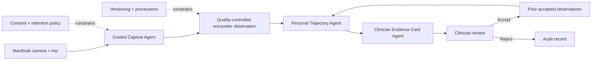

# Neuro Encounter

**Three focused agentic capabilities for longitudinal tele-neurology.**

Neuro Encounter is a telehealth measurement-sidecar hackathon prototype that
uses a MacBook Pro's standard camera and microphone as a stand-in for a future
patient's telehealth device. It explores whether routine appointments can
produce small, trustworthy, longitudinal audiovisual observations without
turning AI into an autonomous clinician.

Built for a future-of-agentic-AI-in-healthcare hackathon on **July 18, 2026**.

> **Research prototype only.** Not a medical device. Not for diagnosis,
> treatment, emergency detection, or use with protected health information.

## The entire product

Neuro Encounter intentionally has only three product capabilities.

### 1. Guided Capture

The system obtains consent, checks the MacBook camera and microphone, guides one
short audiovisual check-in, and retries only when capture quality fails.

The first check-in will contain:

- one brief standardized speech sample; and
- one brief finger-tapping sample captured on video.

The agent's job is not to interpret disease. Its job is to make the observation
repeatable, correctly labeled, and technically usable.

### 2. Personal Trajectory

The system compares today's usable check-in only with the patient's own
compatible prior check-ins:

- same task and prompt version;
- comparable device and capture path;
- documented medication and time context;
- passing quality;
- known algorithm version.

It produces a provisional change estimate with uncertainty. It does not declare
progression or determine why a change occurred.

### 3. Clinician Evidence Card

The system gives a clinician one concise card showing:

- what changed and what remained stable;
- measurement quality and uncertainty;
- relevant context or comparability warnings;
- the current and prior source clips;
- an `accepted` or `rejected` decision with an optional annotation.

Only clinician-accepted observations update the longitudinal record.

Everything else is deferred.

## Product principle

> **Agentic for capture, comparison, and evidence assembly; human-led for
> clinical interpretation and action.**

The product is not a digital neurologist. It is a carefully instrumented memory
for a small part of the neurological encounter.

## Why these three

These capabilities form the smallest clinically meaningful loop:

```text
capture a trustworthy observation
  -> compare it with the same patient over time
  -> present inspectable evidence to a clinician
```

Removing any one breaks the loop:

- Capture without quality creates unreliable measurements.
- Measurements without history recreate a one-time screening classifier.
- Trends without source evidence create a black box clinicians cannot inspect.

## Simplified architecture



Consent, provenance, retention, and human sign-off are required foundations.
They are not separate product features or autonomous agents.

See [docs/architecture.md](docs/architecture.md).

## What happens during one appointment

### Beginning

1. Show a plain-language consent screen and visible recording state.
2. Ask the browser for camera and microphone access.
3. Run a short preflight:
   - microphone clipping and background noise;
   - camera stability, lighting, and hand framing;
   - observed media properties.
4. Capture the standardized speech and finger-tapping samples locally.
5. Offer one bounded retry if quality fails.

### During the routine visit

The prototype does not continuously analyze the whole appointment. The
clinician may inspect the captured check-in while conducting the ordinary visit.
Medication time and obvious confounders can be attached as confirmed context.

### End

1. Close capture and apply the retention policy.
2. Produce a small set of versioned measurements.
3. Select compatible prior observations.
4. Estimate change and uncertainty.
5. Generate the evidence card.
6. Let the clinician accept or reject the result and optionally annotate the
   decision.

The first prototype may use placeholder measurements while the capture and
review loop is built. A placeholder can demonstrate infrastructure but cannot be
presented as a validated biomarker.

## MacBook as the first patient-device adapter

The first adapter targets:

- a modern MacBook Pro;
- its built-in FaceTime camera;
- its built-in microphone;
- a current browser supporting `getUserMedia` and `MediaRecorder`;
- local, task-bound capture;
- local source-clip retention through longitudinal review, with explicit
  deletion controls;
- synthetic data or the developer's own explicitly consented recordings.

The MacBook is not embedded in the core data model. Future phones, tablets, and
telehealth devices should implement the same capture contract.

### Dual-path capture

The future telehealth call and the measurement sample have different needs:

- **Live call:** optimized for communication and network resilience.
- **Local check-in:** short, task-bound, higher-fidelity, and accompanied by
  device and quality metadata.

The prototype builds the local check-in path first as a sidecar to a future
telehealth platform. It does not yet provide live calling and does not attempt
to extract fine biomarkers from a compressed conferencing stream.

## The minimum data model

Each observation contains:

```text
Encounter
  - encounter ID and timestamps
  - consent and retention scope
  - device and browser metadata
  - confirmed medication/context fields

Task
  - task ID and prompt version
  - start/end timestamps
  - completion and retry status

Capture
  - local media reference or hash
  - audio/video properties
  - quality result

Measurement
  - measurement name, value, and unit
  - uncertainty
  - algorithm version
  - source task

Review
  - comparison set
  - provisional change
  - evidence references
  - clinician decision: accepted or rejected
  - optional clinician annotation
```

Measurement, interpretation, and clinical action remain separate.

## Repository map

```text
neuro-encounter/
├── apps/
│   ├── capture-web/             # MacBook consent, preflight, and capture
│   └── clinician-review/        # The evidence card experience
├── agents/
│   ├── guided-capture/          # Capability 1
│   ├── personal-trajectory/     # Capability 2
│   └── evidence-card/           # Capability 3
├── packages/
│   └── contracts/               # Shared encounter and observation contracts
├── protocols/                   # One non-clinical MacBook check-in protocol
├── examples/                    # Synthetic examples only
├── docs/
│   ├── architecture.md
│   ├── safety.md
│   └── validation.md
└── scripts/
```

## Quick start

There is no runnable application yet. The repository currently defines the
system boundary and implementation skeleton.

```bash
git clone https://github.com/logannye/neuro-encounter.git
cd neuro-encounter
npm run check
```

The structural check uses Bash and has no package dependencies.

## First implementation slice

Build one complete local loop:

1. Consent and browser permission.
2. Live MacBook camera preview and microphone meter.
3. One speech sample and one finger-tapping sample.
4. Automatic quality pass, one retry, or explicit failure.
5. A synthetic observation manifest with provenance.
6. A second encounter and explicit trajectory comparison.
7. A clinician evidence card with side-by-side clips.
8. An `accepted` or `rejected` decision, with only accepted observations
   entering history.

That is enough for the hackathon prototype.

## Explicit non-goals

The initial product will not include:

- diagnosis or disease classification;
- medication recommendations or autonomous actions;
- emergency or respiratory-risk prediction;
- rigidity, strength, reflex, sensation, aspiration, or postural-stability
  claims;
- continuous ambient recording;
- natural-conversation interpretation;
- EHR integration;
- a protocol marketplace;
- a large agent mesh;
- a neurological foundation model;
- a general-purpose digital twin;
- clinical-trial endpoints;
- automated patient alerts.

Those ideas may be researched later. They do not belong in the first product.

## Safety foundations

- Recording is visible, scoped, and revocable.
- Raw audiovisual data are minimized and never committed to Git.
- Quality failure returns `not measurable`.
- Transcripts and media are data, never agent instructions.
- Every measurement is linked to its task, media, quality, and algorithm
  version.
- One anomalous encounter does not create a progression claim.
- No AI-generated result updates history without human acceptance.
- No component both recommends and executes a clinical action.

See [docs/safety.md](docs/safety.md).

## Validation posture

The first research question is:

> Can a standard MacBook reliably produce a consented, task-bound,
> quality-described observation that can be compared with a later observation?

Only after that should individual measurements be evaluated for:

1. technical repeatability;
2. device and environment sensitivity;
3. clinical validity;
4. responsiveness to meaningful change;
5. workflow and economic value.

See [docs/validation.md](docs/validation.md).

## Evidence-informed, not clinically validated

The concept is informed by research on:

- [webcam-based Parkinson's finger-tapping assessment](https://www.nature.com/articles/s41746-023-00905-9);
- [remote ALS speech monitoring](https://www.nature.com/articles/s41746-020-00335-x);
- [digital speech response to levodopa](https://www.nature.com/articles/s41531-025-01045-5);
- [limitations of remote MDS-UPDRS assessment](https://pmc.ncbi.nlm.nih.gov/articles/PMC9391277/);
- [FDA remote digital-health guidance](https://www.fda.gov/regulatory-information/search-fda-guidance-documents/digital-health-technologies-remote-data-acquisition-clinical-investigations).

These studies do not validate this prototype or authorize clinical use.

## Contributing

Read [CONTRIBUTING.md](CONTRIBUTING.md) and [AGENTS.md](AGENTS.md). A proposed
change should strengthen one of the three capabilities or a required safety
foundation. Otherwise, defer it.

## License

[MIT](LICENSE)
