# Neurotrax

**A demo-first agentic audiovisual sidecar for longitudinal tele-neurology.**

Neurotrax turns technically measurable moments in a routine audiovisual
encounter into a structured visit observation, compares that observation only
with compatible personal history, and asks GPT-5.6 to draft a tightly grounded
Evidence Card for human review.

Built for a future-of-agentic-AI-in-healthcare hackathon on **July 18, 2026**.

> **Research prototype only.** Neurotrax is not a medical device and is not for
> diagnosis, treatment, emergency detection, or protected health information.
> Every measurement is an unvalidated `prototype.*` engineering signal.

## The three-capability product

Neurotrax intentionally has only three product capabilities.

### 1. Ambient Capture

The MacBook camera and microphone are analyzed ephemerally during a consented
self-demo. Independent speech and face lanes curate measurable windows without
interrupting or coaching the participant.

- Audio: calibrated voice activity, voiced-time fraction, bounded pause rate,
  and pitch variability in semitones.
- Face: visibility, framing, yaw, blink proxy, brow movement, mouth movement,
  normalized landmark motion, illumination, and observed frame rate.
- Quality: a lane withholds its own value when its quality contract fails.
  Other lanes continue independently.

Raw audio and video are never recorded, transcribed, screenshotted, persisted,
or sent to OpenAI.

### 2. Personal Trajectory

A deterministic policy compares the current observation with four checked-in
prior visits for the same synthetic identity. Three are compatible. One is
visibly excluded because its algorithm version differs.

Compatibility is evaluated per biomarker using accepted review state,
participant, measurement code, detected context, algorithm version, speech
SNR, face framing, observed frame rate, and illumination. The output includes a
prior median, range, median absolute deviation, current delta, and one
nonclinical direction.

All seeded points are labeled `SYNTHETIC`. Accepting a live result adds it only
to in-memory history for the page session; rejecting it does not. Reloading
restores the original fixture.

### 3. Clinician Evidence Card

The server sends only bounded structured non-PHI facts to the OpenAI Responses
API. The required `gpt-5.6` model drafts a headline, short summary, and at most
two claims using Structured Outputs.

Every model claim must copy one precomputed claim ID and statement exactly. A
deterministic validator rejects unknown IDs, missing provenance, unsupported
numbers, altered boundary language, or diagnostic, treatment, causal, and
progression language. One grounding retry is allowed. There is deliberately no
deterministic prose fallback.

## The demo moment

Start a live encounter and speak continuously. After a few seconds, briefly
turn your face away while continuing to speak, then return:

1. the facial lane changes to amber `Withheld` after 750 ms;
2. the speech lane remains teal and continues measuring;
3. the facial lane recovers after 750 ms of acceptable framing;
4. the unusable interval becomes a reason-coded abstention;
5. no facial measurement overlaps that interval.

After the encounter, the camera area contracts, compatible synthetic history
appears, GPT-5.6 assembles the grounded Evidence Card, and each claim opens a
trace from claim to aggregate, measurement window, quality/confounds, and
originating events.

## Architecture

```mermaid
flowchart LR
    MEDIA["MacBook camera + mic"] --> FEATURES["Ephemeral derived primitives"]
    FEATURES --> CONDUCTOR["Incremental Capture Conductor"]
    CONDUCTOR --> SPEECH["Speech Acoustic lane"]
    CONDUCTOR --> FACE["Facial Expressivity lane"]
    SPEECH --> OBS["EncounterObservation"]
    FACE --> OBS

    OBS --> TRAJECTORY["Deterministic Personal Trajectory"]
    HISTORY["4 synthetic prior visits"] --> TRAJECTORY
    TRAJECTORY --> FACTS["Pre-grounded claim facts"]
    FACTS --> MODEL["Server-side GPT-5.6 Structured Output"]
    MODEL --> GROUNDING["Deterministic grounding validator"]
    GROUNDING --> CARD["Clinician Evidence Card"]
    CARD --> REVIEW["Human accept / reject"]
    REVIEW -->|"Accept, page session only"| HISTORY

    CONDUCTOR -.-> EVENTS["Append-only workflow events"]
    TRAJECTORY -.-> EVENTS
    MODEL -.-> EVENTS
    REVIEW -.-> EVENTS
```



The language model is outside the measurement and comparison loops. It cannot
create a measurement, change compatible-history membership, or execute a
clinical action.

## Quick start

### Prerequisites

- macOS with Chrome and a MacBook camera/microphone
- Node.js 22 or newer
- pnpm 9.12.3
- an OpenAI API key with access to `gpt-5.6`
- internet access for the Evidence Agent

### Install

```bash
git clone https://github.com/logannye/neurotrax.git
cd neurotrax
corepack enable
pnpm install --frozen-lockfile
cp .env.example .env.local
```

Set the server-only key in `.env.local`:

```dotenv
OPENAI_API_KEY=your_key_here
```

Never use a `VITE_` prefix. The browser can only call the local endpoint; it
cannot read the key.

### Pre-demo checks

Run the deterministic repository suite:

```bash
pnpm test
```

Run the disclosed full browser state-machine test:

```bash
pnpm test:browser
```

Verify the real model, credential, Structured Output schema, and grounding:

```bash
pnpm demo:smoke
```

The smoke command makes a real API request. If the key is absent or the model
cannot return a grounded result, it fails loudly.

### Launch

```bash
pnpm dev
```

Open [http://127.0.0.1:4173](http://127.0.0.1:4173). The startup bar must read
`Demo systems ready`. Then:

1. check **I consent to this self-demo**;
2. choose **Begin live encounter**;
3. approve Chrome camera and microphone access;
4. speak naturally for 20–30 seconds;
5. briefly turn away while continuing to speak, then face the camera again;
6. choose **End & analyze**;
7. select a grounded claim to inspect its evidence trace;
8. choose **Accept for this session** or **Reject**.

The app refuses to begin when `OPENAI_API_KEY` is missing. It releases the media
tracks before trajectory selection and evidence synthesis.

## Disclosed fixture mode

The genuine hardware path is the default. A deterministic fixture exists for
browser testing and emergency rehearsal:

```text
http://127.0.0.1:4173/?fixture=1
```

It is persistently labeled `FIXTURE PLAYBACK · NOT LIVE`, uses only synthetic
derived frames, and never requests camera or microphone access. Add `&fast=1`
only for automated testing. It still requires the Evidence Agent unless a
browser test explicitly intercepts the endpoint.

## What the agents actually do

The right-side rail is a filtered view of real versioned workflow events—not
private chain-of-thought or decorative agent dialogue.

- **Capture Conductor:** ingests frames incrementally, opens and closes
  candidate windows, routes eligible windows, and creates the observation.
- **Speech Acoustic:** calibrates its noise floor, applies VAD hysteresis,
  measures usable speech windows, and withholds unusable intervals.
- **Facial Expressivity:** receives only derived primitives from a Web Worker,
  applies framing/yaw quality gates, measures usable windows, and abstains.
- **Personal Trajectory:** includes or excludes prior encounters by explicit
  compatibility policy and computes robust personal-reference statistics.
- **Evidence Agent:** requests a structured GPT-5.6 draft, validates every
  claim, exposes grounding failure, and waits for human review.

## Privacy and data flow

### Remains in the browser and is discarded

- microphone samples;
- camera frames and `ImageBitmap` objects;
- local MediaPipe landmark inference input;
- per-frame derived audio and face primitives after page unload.

### Sent to the local server and OpenAI

- synthetic identifiers;
- quality counts;
- excluded synthetic encounter IDs and reason codes;
- at most two structured claim facts;
- measurement codes, numeric values, units, directions, and evidence
  references.

No conversation content, transcript, image, audio sample, or camera frame is
included in the model request.

## Measurement and quality contracts

The current extractor versions are:

```text
speech-acoustic-0.2
facial-expressivity-0.1
```

The face lane withholds after 750 ms without a usable face or when absolute yaw
exceeds 30 degrees. It recovers after 750 ms of acceptable framing. Speech uses
entry/exit hysteresis and treats only 300–2,000 ms gaps as bounded pauses for
the pause-rate metric.

Every aggregate preserves its detected context, algorithm version, median
quality confounds, confidence, placeholder uncertainty, and
`clinicalValidation: "none"`.

## Commands

```bash
pnpm dev                 # local live demo on 127.0.0.1:4173
pnpm demo:smoke          # real GPT-5.6 readiness/grounding request
pnpm test                # structure, unit tests, types, production build
pnpm test:browser        # disclosed full UI state-machine test in Chrome
pnpm typecheck           # all workspace TypeScript checks
pnpm build               # production browser asset build
```

## Repository map

```text
neurotrax/
├── apps/capture-web/
│   ├── src/                 # live UI, audio features, face worker
│   ├── server/              # server-only OpenAI endpoint and smoke check
│   ├── e2e/                 # disclosed fixture browser tests
│   └── public/              # pinned local MediaPipe model and WASM
├── packages/
│   ├── ambient-core/        # incremental conductor and extractors
│   ├── contracts/           # shared observation/event/trajectory/card types
│   ├── trajectory-core/     # compatibility policy and synthetic history
│   └── evidence-core/       # claim facts and deterministic grounding
├── docs/
│   ├── architecture.md
│   ├── demo-experience.md
│   ├── safety.md
│   └── validation.md
└── scripts/validate-structure.sh
```

## Explicit deferrals

This MVP does not provide telehealth calling, PHI handling, transcripts,
retained evidence clips, EHR integration, population comparison, alerts,
diagnosis, treatment recommendations, medication-effect inference, clinical
progression claims, or validated neurological biomarkers.

## License

[MIT](LICENSE)
