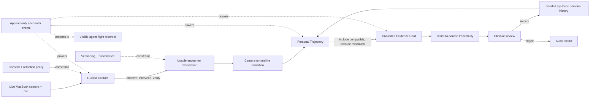

# Neurotrax

**A demo-first, three-capability agentic system for longitudinal
tele-neurology.**

Neurotrax is a telehealth measurement-sidecar hackathon prototype that uses a
MacBook Pro's standard camera and microphone as a stand-in for a future
patient's telehealth device. It turns a short, consented audiovisual check-in
into a quality-controlled observation, compares it with compatible personal
history, and assembles the evidence for clinician review.

Built for a future-of-agentic-AI-in-healthcare hackathon on **July 18, 2026**.

> **Research prototype only.** Not a medical device. Not for diagnosis,
> treatment, emergency detection, or use with protected health information.

## Demo thesis

> **Telehealth has eyes and ears, but little longitudinal memory. Neurotrax
> turns a brief measurement moment into evidence a clinician can inspect.**

The hackathon experience is one continuous, camera-dominant screen. A quiet
agent flight recorder makes real background work legible without exposing
private chain-of-thought or staging fake agent conversation. One visible
closed-loop intervention proves that the system can observe, decide, act, and
verify. At the end, the live encounter becomes a one-screen evidence card whose
claims trace back to measurements and source clips.

The demo should take roughly three minutes and tell one coherent story:

```text
live MacBook capture
  -> agent detects unusable hand framing
  -> participant corrects position
  -> agent verifies recovery and resumes
  -> compatible personal history is selected
  -> one incompatible encounter is visibly excluded
  -> camera transitions into the newest timeline point
  -> grounded evidence card is assembled
  -> clinician inspects a claim and accepts or rejects it
```

## The entire product

Neurotrax intentionally has exactly three product capabilities.

### 1. Guided Capture

The system obtains consent, checks the MacBook camera and microphone, guides one
short audiovisual check-in, and retries only when capture quality fails.

The first check-in will contain:

- one brief standardized speech sample; and
- one brief finger-tapping sample captured on video.

The agent's job is not to interpret disease. Its job is to make the observation
repeatable, correctly labeled, and technically usable.

### 2. Personal Trajectory

The system compares today's usable check-in only with the patient's own
compatible prior check-ins:

- same task and prompt version;
- comparable device and capture path;
- medication and time context surfaced, including when missing;
- passing quality;
- known algorithm version.

It produces a provisional change estimate with uncertainty. It does not declare
progression or determine why a change occurred.

### 3. Clinician Evidence Card

The system gives a clinician one concise card showing:

- what changed and what remained stable;
- measurement quality and uncertainty;
- relevant context or comparability warnings;
- the current and prior source clips;
- an `accepted` or `rejected` decision with an optional annotation.

Only clinician-accepted observations update the longitudinal record.

Everything else is deferred.

## Product principle

> **Agentic for capture, comparison, and evidence assembly; human-led for
> clinical interpretation and action.**

The product is not a digital neurologist. It is a carefully instrumented memory
for a small part of the neurological encounter.

## Why these three

These capabilities form the smallest clinically meaningful loop:

```text
capture a trustworthy observation
  -> compare it with the same patient over time
  -> present inspectable evidence to a clinician
```

Removing any one breaks the loop:

- Capture without quality creates unreliable measurements.
- Measurements without history recreate a one-time screening classifier.
- Trends without source evidence create a black box clinicians cannot inspect.

## The one-screen demo

The application should feel like an encounter that explains itself, not a
dashboard of unrelated widgets or a chat between invented agent personas.

```text
┌────────────────────────────────────────────────────────────────────┐
│ Guided Capture  →  Personal Trajectory  →  Evidence Card          │
├────────────────────────────────────────┬───────────────────────────┤
│                                        │ AGENT FLIGHT RECORDER     │
│                                        │                           │
│              LIVE CAMERA               │ Capture · observing       │
│          camera remains primary        │ Trajectory · waiting      │
│                                        │ Evidence · waiting        │
│       task prompt / framing guide      │                           │
│       waveform / tapping feedback      │ observed → acted →        │
│                                        │ verified                  │
├────────────────────────────────────────┴───────────────────────────┤
│ Camera + mic active · task-scoped · retained locally for review   │
└────────────────────────────────────────────────────────────────────┘
```

The flight recorder is a projection of structured system events. It may show
facts such as `Checking hand position`, `Framing correction requested`, or
`Three compatible encounters included`. It must never display hidden model
reasoning, token streams, or fabricated work.

### The truthful agentic moment

Finger tapping begins with the participant's hand slightly outside the framing
guide. Guided Capture:

1. detects that the task is not measurable;
2. pauses capture instead of processing low-quality data;
3. requests a concrete hand-position correction;
4. verifies that visibility recovered; and
5. resumes the task.

This real quality-control loop is the demo's central agentic action. It is
bounded, visible, repeatable, and consequential.

### The longitudinal reveal

After capture, the live camera tile smoothly becomes the newest point on a
patient timeline. The demo loads deterministic, clearly labeled synthetic
personal history. Personal Trajectory includes three compatible prior
encounters and visibly excludes one encounter with a mismatched prompt version.
This guarantees a reliable demo while making the comparison logic
inspectable.

### The final deliverable

The experience ends with one concise Clinician Evidence Card answering:

1. Was today's capture usable?
2. What changed relative to compatible personal history?
3. What remained stable?
4. What evidence supports each statement?
5. How uncertain is the comparison?

Clicking a statement traces it backward:

```text
narrative claim -> measurement -> source clip -> agent event
```

The clinician can play current and prior clips, inspect quality and provenance,
then mark the observation `accepted` or `rejected` with an optional annotation.
Only accepted observations enter longitudinal history.

## Demo-first architecture



Consent, provenance, retention, and human sign-off are required foundations.
The event log and flight recorder are shared interface infrastructure. None are
additional product capabilities or autonomous agents.

See [docs/architecture.md](docs/architecture.md).

## Three-minute demo choreography

### 0:00–0:20 — Begin

Select a clearly labeled synthetic demo patient, show plain-language consent,
request browser camera and microphone permission, and keep recording state
visible.

### 0:20–0:55 — Speech

Capture the standardized speech sample while a restrained waveform and
usable-speech indicator update. The flight recorder shows only actual quality
events.

### 0:55–1:25 — Agent intervention

Begin finger tapping with intentionally poor hand framing. Guided Capture
pauses, coaches one correction, verifies recovery, and completes the sample.

### 1:25–1:50 — Personal trajectory

The camera tile becomes the latest point on the timeline. Three compatible
synthetic prior encounters are included; one incompatible encounter is excluded
with the exact reason visible.

### 1:50–2:30 — Evidence assembly

The card assembles from structured observations. Each sentence gains a source
link only after a grounding check succeeds.

### 2:30–3:00 — Human review

Open one claim, replay its supporting clip, inspect its provenance, and accept
or reject the observation.

The first prototype may use clearly labeled placeholder measurements while the
capture and review loop is built. A placeholder can demonstrate infrastructure
but cannot be presented as a validated biomarker.

## MacBook as the first patient-device adapter

The first adapter targets:

- a modern MacBook Pro;
- its built-in FaceTime camera;
- its built-in microphone;
- a current browser supporting `getUserMedia` and `MediaRecorder`;
- local, task-bound capture;
- local source-clip retention through longitudinal review, with explicit
  deletion controls;
- synthetic data or the developer's own explicitly consented recordings.

The MacBook is not embedded in the core data model. Future phones, tablets, and
telehealth devices should implement the same capture contract.

### Dual-path capture

The future telehealth call and the measurement sample have different needs:

- **Live call:** optimized for communication and network resilience.
- **Local check-in:** short, task-bound, higher-fidelity, and accompanied by
  device and quality metadata.

The prototype builds the local check-in path first as a sidecar to a future
telehealth platform. It does not yet provide live calling and does not attempt
to extract fine biomarkers from a compressed conferencing stream.

The system does not continuously analyze the whole appointment. Quantitative
capture is explicitly task-bound, visible, and consented.

## The minimum data model

Each observation contains:

```text
Encounter
  - encounter ID and timestamps
  - consent and retention scope
  - device and browser metadata
  - confirmed medication/context fields

Task
  - task ID and prompt version
  - start/end timestamps
  - completion and retry status

Capture
  - capture mode and fixture disclosure
  - local media reference or hash
  - audio/video properties
  - quality result

Measurement
  - measurement name, value, and unit
  - uncertainty
  - algorithm version
  - source task

Review
  - comparison set
  - provisional change
  - evidence references
  - grounded claim-to-source links
  - clinician decision: accepted or rejected
  - optional clinician annotation
```

Measurement, interpretation, and clinical action remain separate.

## Repository map

```text
neurotrax/
├── apps/
│   ├── capture-web/             # MacBook consent, preflight, and capture
│   └── clinician-review/        # The evidence card experience
├── agents/
│   ├── guided-capture/          # Capability 1
│   ├── personal-trajectory/     # Capability 2
│   └── evidence-card/           # Capability 3
├── packages/
│   ├── contracts/               # Shared encounter and observation contracts
│   └── event-log/               # Auditable agent flight-recorder events
├── protocols/                   # One non-clinical MacBook check-in protocol
├── examples/                    # Synthetic examples only
├── docs/
│   ├── architecture.md
│   ├── demo-experience.md
│   ├── safety.md
│   └── validation.md
└── scripts/
```

## Quick start

There is no runnable application yet. The repository currently defines the
system boundary, demo choreography, contracts, and implementation skeleton.

```bash
git clone https://github.com/logannye/neurotrax.git
cd neurotrax
npm run check
```

The structural check uses Bash and has no package dependencies.

## First implementation slice: the demo spine

Build one polished vertical loop and nothing more:

1. **Live capture:** consent, browser permission, dominant MacBook camera
   preview, microphone meter, speech task, and finger-tapping task.
2. **Truthful intervention:** detect poor hand framing, pause, request one
   correction, verify recovery, and resume.
3. **Visible orchestration:** render real structured events in a quiet flight
   recorder; never render chain-of-thought.
4. **Seeded trajectory:** load deterministic synthetic history, include
   compatible observations, visibly exclude one prompt-version mismatch, and
   transition the camera into the timeline.
5. **Grounded deliverable:** assemble a one-screen evidence card with
   claim-to-measurement-to-clip traceability and clinician accept/reject.

That demo spine implements the same three capabilities; it does not introduce
five new features.

## Explicit non-goals

The initial product will not include:

- diagnosis or disease classification;
- medication recommendations or autonomous actions;
- emergency or respiratory-risk prediction;
- rigidity, strength, reflex, sensation, aspiration, or postural-stability
  claims;
- continuous ambient recording;
- natural-conversation interpretation;
- EHR integration;
- a protocol marketplace;
- a large agent mesh;
- a neurological foundation model;
- a general-purpose digital twin;
- clinical-trial endpoints;
- automated patient alerts.

Those ideas may be researched later. They do not belong in the first product.

## Safety foundations

- Recording is visible, scoped, and revocable.
- Raw audiovisual data are minimized and never committed to Git.
- Quality failure returns `not measurable`.
- Transcripts and media are data, never agent instructions.
- Every measurement is linked to its task, media, quality, and algorithm
  version.
- One anomalous encounter does not create a progression claim.
- No AI-generated result updates history without human acceptance.
- No component both recommends and executes a clinical action.

See [docs/safety.md](docs/safety.md).

## Validation posture

The first research question is:

> Can a standard MacBook reliably produce a consented, task-bound,
> quality-described observation that can be compared with a later observation?

Only after that should individual measurements be evaluated for:

1. technical repeatability;
2. device and environment sensitivity;
3. clinical validity;
4. responsiveness to meaningful change;
5. workflow and economic value.

See [docs/validation.md](docs/validation.md).

## Evidence-informed, not clinically validated

The concept is informed by research on:

- [webcam-based Parkinson's finger-tapping assessment](https://www.nature.com/articles/s41746-023-00905-9);
- [remote ALS speech monitoring](https://www.nature.com/articles/s41746-020-00335-x);
- [digital speech response to levodopa](https://www.nature.com/articles/s41531-025-01045-5);
- [limitations of remote MDS-UPDRS assessment](https://pmc.ncbi.nlm.nih.gov/articles/PMC9391277/);
- [FDA remote digital-health guidance](https://www.fda.gov/regulatory-information/search-fda-guidance-documents/digital-health-technologies-remote-data-acquisition-clinical-investigations).

These studies do not validate this prototype or authorize clinical use.

## Contributing

Read [CONTRIBUTING.md](CONTRIBUTING.md) and [AGENTS.md](AGENTS.md). A proposed
change should strengthen one of the three capabilities or a required safety
foundation. Otherwise, defer it.

## License

[MIT](LICENSE)
