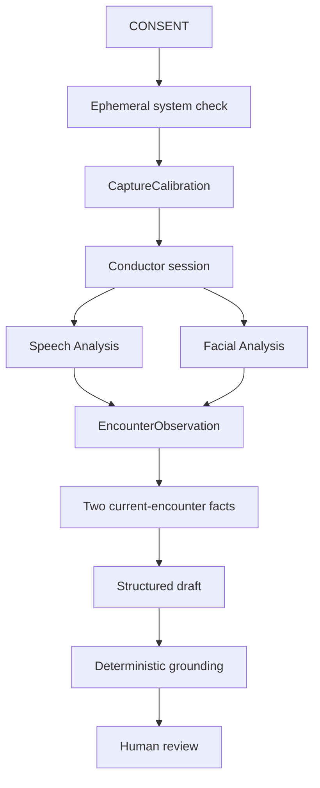

# Neurotrax architecture

## Presentation capabilities

The live application exposes two capabilities:

1. Ambient audiovisual assessment.
2. Clinician encounter summary with human review.

Longitudinal comparison remains an internal package but is not connected to
the presentation application.

## Capture boundary

After explicit consent, the web application performs an ephemeral system
check. It derives:

- a quiet-room audio profile;
- speech entry and exit thresholds;
- median face size and position;
- baseline illumination.

The system check produces a `CaptureCalibration`. Raw media is neither
recorded nor retained.

`createConductorSession()` receives the calibration and an injectable
`CaptureQualityPolicy`. It ingests derived audio and facial frames, maintains
independent quality state for each modality, opens and closes measurable
windows, and emits append-only workflow events.

## Guided workflow

The browser-level guided controller does not create measurements. It observes
real capture state and enables completion only after:

1. a speech window and initial facial window;
2. facial withholding while speech continues;
3. facial recovery;
4. a post-recovery facial window.

The conductor remains responsible for the authoritative observation and
abstentions.

## Signal extraction

Speech Analysis uses a calibrated noise floor, energy hysteresis, pitch
correlation, bounded pause detection, and per-measurement confidence. Pitch
variability requires at least ten pitched frames and 20% pitch coverage.

Facial Analysis derives landmarks, blendshape proxies, pose, geometry,
illumination, and normalized movement in an isolated browser thread. Framing
is evaluated relative to the system-check baseline.

## Clinical synthesis

The evidence layer selects exactly one supported speech aggregate and one
supported facial aggregate from the current encounter. It creates immutable
claim facts with measurement, window, quality, and event references.

The server-side synthesis service may draft only from those facts. A
deterministic validator requires both statements, rejects unsupported numbers
or clinical interpretation, and preserves the review boundary. The user may
then approve or dismiss the summary.

## Data flow

