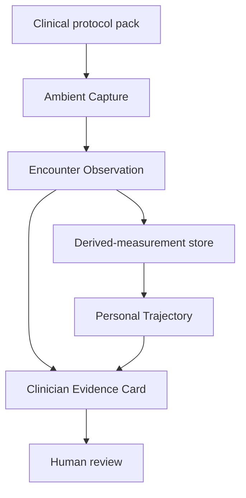
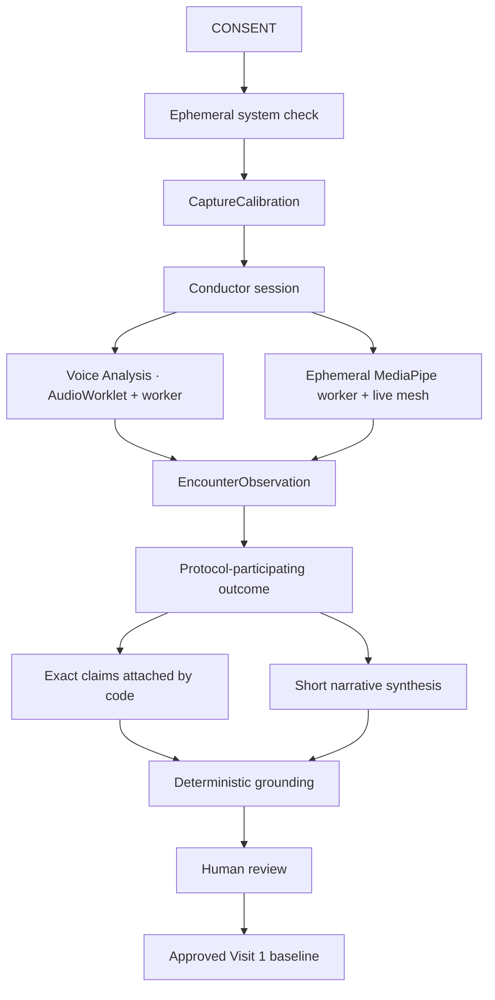

# PhenoMetric architecture

## Product capabilities

The platform has exactly three product capabilities:

1. **Ambient Capture** qualifies and measures consented face and voice signals.
2. **Personal Trajectory** compares compatible, accepted observations from the
   same person.
3. **Clinician Evidence Card** presents grounded measurements and trajectory
   evidence for human review.

The current live application exposes Ambient Capture and the Clinician Evidence
Card. Personal Trajectory remains a tested internal package; approval displays
a Visit 1 baseline concept, but no derived-measurement store or live
multi-visit comparison is connected.

Medical applications are not additional product capabilities. Each is a
versioned clinical protocol pack that configures the three capabilities for one
intended use and population. The target platform architecture is described in
[`telehealth-platform-vision.md`](telehealth-platform-vision.md).

## Platform layers

The shared platform owns capture, measurement contracts, compatibility,
evidence, and governance. A protocol pack owns clinical context: target
population, tasks, measurements, quality contract, confounders, reference
standard, uncertainty model, validated language, and expected human workflow.

## Capture boundary

After explicit consent, the web application performs an ephemeral system
check. It derives:

- a quiet-room audio profile and actual microphone settings;
- voice quality, periodicity coverage, and stream continuity;
- median face size and position;
- baseline illumination and sharpness; and
- observed visual cadence and usable-coverage statistics.

The system check produces a `CaptureCalibration`. Raw media is neither
recorded nor retained. Facial Foundation requests camera plus microphone;
Voice Foundation requests no camera. The visual path requests 1280×720 at an
ideal 30 fps. The voice path requests mono audio at an ideal 48 kHz with echo
cancellation, noise suppression, and automatic gain control disabled.
Acquisition timestamps are preserved through both worker paths.

`createConductorSession()` receives the calibration and an injectable
`CaptureQualityPolicy`. It ingests derived audio and facial frames, maintains
independent quality state for each modality, opens and closes measurable
windows, and emits append-only workflow events.

The MediaPipe worker is the native visual boundary. The complete landmark set,
blendshapes, transformation matrix, and source bitmap exist only for the
current inference and never leave the worker. The worker emits a compact,
versioned `FacialKinematicsFrameV1` with anatomical laterality, normalized
geometry, pose, quality observations, timing, and processor provenance.

The application transfers a separate `OffscreenCanvas` into that same worker.
At no more than 12 Hz, the worker draws all 478 points, the complete MediaPipe
facial tessellation, and task-relevant contour and measurement-anchor accents.
The drawing uses unmirrored normalized coordinates and shares the preview's CSS
mirror, so display alignment cannot change stored anatomical laterality.
Neither native landmark coordinates, mesh connections, screenshots, nor
overlay pixels cross back into application messages or serialized artifacts.
The canvas is cleared at every visual-withholding and media lifecycle boundary
and recreated after a worker restart. Browsers without transferred-canvas
support retain the native-landmark-free bounding-box display.

The voice worker is the native audio boundary. An `AudioWorklet` transfers
continuous 20 ms blocks into a bounded 30-second ring. Analysis uses 40 ms
windows on a 10 ms hop and resets across missing blocks instead of synthesizing
silence. The worker emits only `VoiceSignalFrameV1`. PCM, waveform arrays,
pitch cycles, FFT bins, cepstra, MFCCs, formant tracks, spectrograms,
transcripts, and embeddings never enter observation or event contracts. See
[`voice-foundation.md`](voice-foundation.md).

## Guided workflows

Browser-level guided controllers do not create measurements. Facial Foundation
runs this completion-gated, nonclinical policy:

1. 1.5 seconds of continuous usable face plus voiced, unclipped speech;
2. 750 ms of intentional face absence or out-of-range pose while speech
   remains voiced;
3. 1.5 seconds of usable face plus non-voiced audio for a quiet neutral
   reference;
4. 1.5 seconds of usable, silent evidence including at least 500 ms of
   threshold-crossing smile excursion; and
5. 1.5 seconds of usable, silent evidence in which the same eye closes for at
   least 300 ms and recovers for at least 300 ms.

Elapsed time alone never advances a phase, and no skip is available. A quality
break—or more than 200 ms between visual results—resets the current continuous
streak without changing phases. After
twelve seconds, the coordinator exposes criterion-specific corrective
guidance, and the participant can continue retrying indefinitely or explicitly
end and discard the assessment. A worker restart resets the current gate; a
visual-processor change after neutral capture returns the workflow to neutral
and invalidates later facial completions.

Every confirmed transition carries its accepted evidence interval. The
conductor clips final neutral, smile, and eye-closure windows to those exact
intervals, so failed attempts cannot affect a baseline or measurement. Shared
pure baseline and task-adherence evaluators are used by both live gating and
final extraction. Non-guided consumers retain task-specific abstention
behavior.

Voice Foundation performs two seconds of quiet calibration and 1.5 seconds of
usable natural speech, then gates two sustained vowels, standardized reading,
rapid `/pa-ta-ka/`, and a spontaneous response. Each task must satisfy its
signal criterion; the spontaneous task alone permits brief natural pauses.
Only final qualifying intervals reach extraction.

This guided sequence is a presentation fixture, not the target protocol system.
The generalized platform will support both natural conversational windows and
brief protocol-defined microtasks. Prompting remains a context within Ambient
Capture and must not bypass the conductor's quality or abstention authority.

## Signal extraction

Voice Analysis applies centralized rules for sample rate, rolling continuity,
SNR, clipping, DC offset, and browser processing state. Independent pitch
estimators cover 50–700 Hz with agreement and octave checks. Eighteen named
`prototype.voice.*` measurement types span general acoustics, sustained
phonation, formants, timing, estimated syllabic/DDK behavior, and onset.
Fine-acoustic values abstain independently unless their stricter requirements
are satisfied. Uncertainty uses within-task 500 ms MAD and between-trial MAD
for repeated vowels; non-repeatable values state why it was not estimated.

Facial Analysis uses MediaPipe landmarks and its transformation matrix inside
the isolated worker to derive model-independent pose and normalized geometry.
The subject's anatomical left eye uses the 362/263 region and left mouth corner
uses landmark 291; the right side uses 33/133 and 61. Preview mirroring is CSS
only and cannot change stored laterality. Eye aperture is a lid-gap-to-canthal
width ratio. Mouth-corner coordinates are translated to the eye midpoint,
scaled by inter-eye distance, and rotated to the eye line. Motion is divided by
elapsed acquisition time.

One pure evaluator applies the same visual quality rules during system check,
capture, and final window detection. It checks cadence and gaps, skipped-frame
fraction, face size and margins, pose, face-region luminance and clipping, and
sharpness relative to calibration. A hidden tab, muted or ended camera,
worker outage, or visual result gap over 200 ms withholds only facial analysis.

Accepted neutral, smile, and eye-closure windows produce six bilateral task
measurements:

- left and right smile excursion, plus absolute asymmetry; and
- left and right eye-closure fraction, plus absolute asymmetry.

Facial Foundation produces only those six facial measurements; audio remains a
behavioral gate. Voice Foundation produces only voice measurements and never
starts the visual worker. None of these outputs has clinical validation.

## Personal trajectory

`@phenometric/trajectory-core` currently matches prior observations by
participant, review state, measurement code, task context, algorithm version,
processor reference, and explicit confound tolerances. Voice compatibility
also exact-matches browser-processing state and sample-rate class. A changed
voice or visual processor starts a new baseline.

The production target adds:

- privacy-preserving persistence of accepted derived observations;
- repeated-baseline and minimum-data rules;
- task, protocol, device, medication-state, and clinical-context
  compatibility;
- repeatability-based uncertainty and minimum detectable change;
- algorithm-upgrade migration or bridge policies; and
- visible missingness and incompatibility rather than silent omission.

A trajectory describes compatible measurement change. It does not imply
disease progression, cause, prognosis, or treatment response unless a clinical
protocol pack has independently validated that claim.

## Clinical synthesis and report export

The observation layer aggregates measurements within code and task context.
The evidence layer sends one outcome for the modality participating in the
selected protocol. Voice evidence prefers sustained-vowel CPPS, then DDK
interval variability, then spontaneous-response pause rate. Facial evidence
prefers smile-excursion asymmetry and falls back to eye-closure asymmetry.

As soon as the final valid window closes, the application assembles the
grounded statement and starts server-side synthesis in the background. The
synthesis service returns only a short headline and one-sentence narrative.
Application code attaches the exact outcome statements and review boundary,
then a deterministic validator rejects unsupported numbers or clinical
interpretation. This smaller generation contract reduces latency and prevents
claim drift. If narrative synthesis is unavailable, deterministic outcomes
remain reviewable and the interface never waits indefinitely.

Only measured values appear in the EHR-ready report. Each quantitative profile
item can open a presentation-safe provenance chain, while primary
statements retain the stricter claim-grounding path. Unavailable modalities
remain part of acquisition provenance but are omitted from the clinical
narrative. The copy action places the clinician-reviewed report on the local
clipboard; no EHR connection or write is implemented.

Future interoperability should export only clinician-reviewed, protocol-valid
observations through a defined clinical schema such as a FHIR-compatible
Observation or document. Authentication, authorization, correction,
adjudication, audit, retention, and rollback must exist before any real EHR
integration.

## Data flow

## Research and production separation

The current capture path processes raw media ephemerally and retains no
recording, screenshot, transcript, or clip. This remains the production
direction.

Analytical and clinical validation may require a separately governed research
system that retains explicitly consented source media for expert annotation and
reference-standard comparison. That system is not implemented here. It must
remain isolated from production capture and require its own consent, access,
retention, deletion, security, and institutional-review controls.

## Known platform gaps

- no `ClinicalProtocolPack` or measurement-registry contract;
- no persistent derived-measurement store or live multi-visit trajectory;
- engineering-only uncertainty and no clinically validated endpoints;
- prototype rather than clinical-grade face and voice extractors;
- no patient identity, authorization, consent record, or clinical audit store;
- no clinician correction or adjudication workflow;
- no FHIR or EHR integration;
- no regulated model and protocol change-control process; and
- no research media-governance environment.
