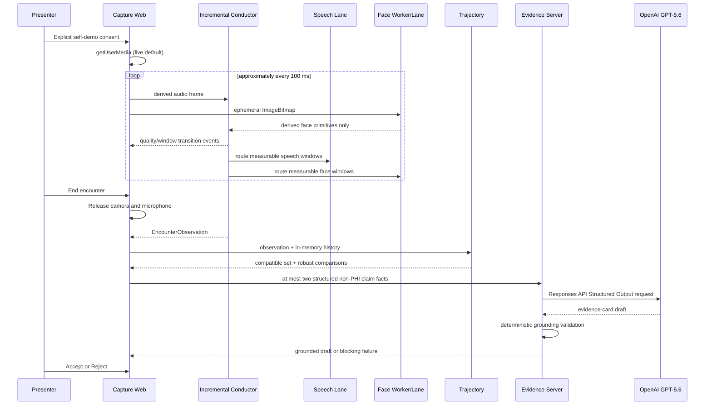

# Neurotrax demo-complete architecture

## Product boundary

Neurotrax has exactly three capabilities: Ambient Capture, Personal
Trajectory, and Clinician Evidence Card. Consent, workflow events, provenance,
and human review are shared foundations, not additional clinical agents.

## Runtime flow

## Ambient Capture

`createConductorSession()` is the incremental API. It ingests audio and face
frames independently, emits append-only workflow events as state changes
occur, closes open windows at encounter end, and returns the final
`EncounterObservation`. `runConductor()` remains the deterministic replay
wrapper used by fixtures and tests.

The MediaPipe task and WASM are pinned and stored under
`apps/capture-web/public`. Face inference is synchronous inside a Web Worker,
not the UI thread. The worker closes every `ImageBitmap` and posts only derived
primitives and display overlay geometry.

Quality transitions are debounced. A facial lane fails independently after
750 ms without a usable face, framing below 0.60, or absolute yaw above 30
degrees. Speech uses calibrated entry and exit thresholds. Both lanes can
record reason-coded abstentions; neither fabricates a value for an invalid
interval.

## Personal Trajectory

`trajectory-core` evaluates each prior encounter against every current
biomarker. It checks:

- accepted review state;
- same participant;
- same measurement code and detected context;
- exact algorithm version;
- speech SNR within 6 dB;
- face-framing difference no greater than 0.15;
- observed-frame-rate difference no greater than 25%; and
- illumination difference no greater than 0.20.

Only matching biomarker values enter the median, range, and median absolute
deviation. Direction vocabulary is nonclinical: `within-reference`,
`above-reference`, `below-reference`, or `not-comparable`.

The original four-visit fixture is immutable for a page load. Human acceptance
adds a current observation to a separate in-memory array; rejection does not.

## Evidence Agent

The browser sends structured facts to `/api/evidence-card`. The endpoint uses
`openai@6.48.0`, `zod@4.4.3`, the Responses API, and `gpt-5.6`. The API key is
loaded only in Vite's server process from the root environment or
`.env.local`.

The model selects at most two precomputed facts. It must copy their claim IDs
and statements exactly. Grounding rejects:

- unknown or duplicate claim IDs;
- paraphrased pre-grounded statements;
- missing measurement/window/event provenance;
- unsupported numeric tokens;
- altered safety boundary text;
- diagnostic, progression, causal, treatment, risk, or normality language; and
- a summary that does not identify every selected measurement.

A first grounding failure is retried once with only the validation errors. API,
timeout, refusal, schema, or second-grounding failure becomes a transparent
blocking state. There is no prose fallback.

## Unified workflow events

All stages share `neurotrax.workflow-event.v0.2`. Every event includes a
monotonic sequence, occurrence time, participant/visit identity, actor and
stage, type, human-readable summary, structured payload, and evidence
references. Causal events may use `causedByEventId`.

The UI rail renders these records directly. It never displays chain-of-thought,
token streams, or invented inter-agent conversation.

## Retention boundary

Raw media exists only in live browser/worker memory. No recording, screenshot,
transcript, clip, or raw-media upload path exists. The current MVP retains
derived frames only until page unload and accepted structured observations only
for the current page session.
