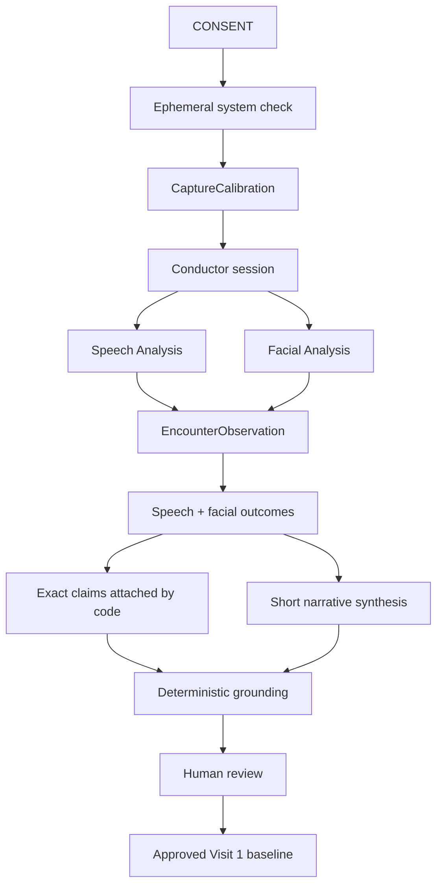

# Neurotrax architecture

## Presentation capabilities

The live application exposes two capabilities:

1. Ambient audiovisual assessment.
2. Clinician encounter summary with human review.

Longitudinal comparison remains an internal package but is not connected to
the presentation application.

## Capture boundary

After explicit consent, the web application performs an ephemeral system
check. It derives:

- a quiet-room audio profile;
- speech entry and exit thresholds;
- median face size and position;
- baseline illumination.

The system check produces a `CaptureCalibration`. Raw media is neither
recorded nor retained.

`createConductorSession()` receives the calibration and an injectable
`CaptureQualityPolicy`. It ingests derived audio and facial frames, maintains
independent quality state for each modality, opens and closes measurable
windows, and emits append-only workflow events.

## Guided workflow

The browser-level guided controller does not create measurements. It runs a
fixed twenty-four-second policy:

1. seven seconds centered and speaking;
2. four seconds turning away while speaking;
3. seven seconds returning to center;
4. six seconds for the final measurement window.

Each phase records `confirmed`, `not-confirmed`, or `pending`. The coordinator
always advances at the phase deadline, while the conductor remains responsible
for authoritative measurements and abstentions. Only missing consent or denied
device access can prevent the encounter from starting.

## Signal extraction

Speech Analysis uses a calibrated noise floor, energy hysteresis, pitch
correlation, bounded pause detection, and per-measurement confidence. Pitch
variability requires at least ten pitched frames and 20% pitch coverage.

Facial Analysis derives landmarks, blendshape proxies, pose, geometry,
illumination, and normalized movement in an isolated browser thread. Framing
is evaluated relative to the system-check baseline.

## Clinical synthesis and report export

The evidence layer creates exactly one speech outcome and one facial outcome.
Each is either measured, with immutable measurement and provenance, or
withheld, with a reason, quality facts, and evidence references.

As soon as the final valid window closes, the application assembles both
grounded statements and starts server-side synthesis in the background. The
synthesis service returns only a short headline and one-sentence narrative.
Application code attaches the exact outcome statements and review boundary,
then a deterministic validator rejects unsupported numbers or clinical
interpretation. This smaller generation contract reduces latency and prevents
claim drift. If narrative synthesis is unavailable, the two deterministic
outcomes remain reviewable and the interface never waits indefinitely.

Only measured outcomes appear in the EHR-ready report. Unavailable modalities
remain part of acquisition provenance but are omitted from the clinical
narrative. The copy action places the clinician-reviewed report on the local
clipboard; no EHR connection or write is implemented.

## Data flow

