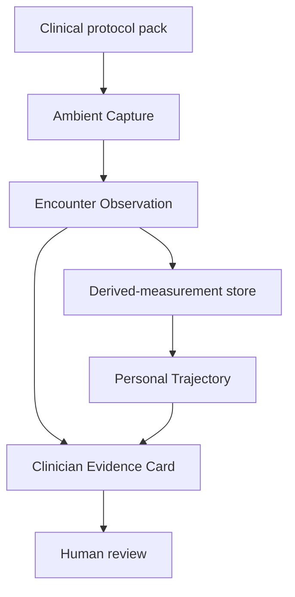
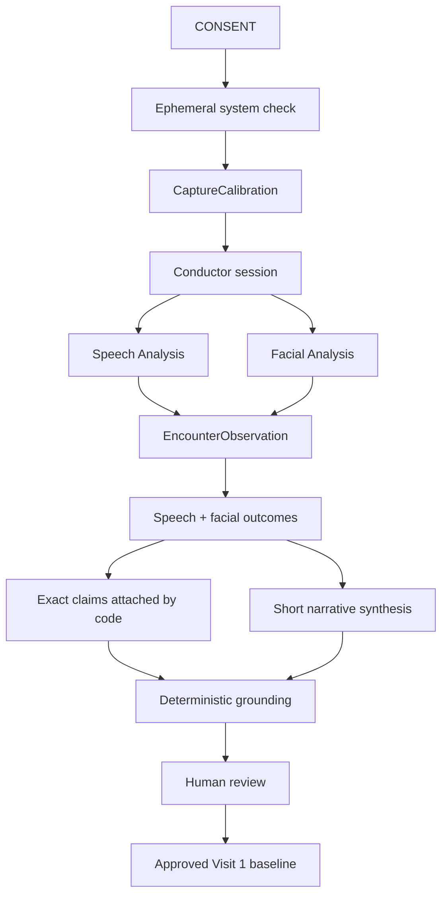

# PhenoMetric architecture

## Product capabilities

The platform has exactly three product capabilities:

1. **Ambient Capture** qualifies and measures consented face and voice signals.
2. **Personal Trajectory** compares compatible, accepted observations from the
   same person.
3. **Clinician Evidence Card** presents grounded measurements and trajectory
   evidence for human review.

The current live application exposes Ambient Capture and the Clinician Evidence
Card. Personal Trajectory remains a tested internal package; approval displays
a Visit 1 baseline concept, but no derived-measurement store or live
multi-visit comparison is connected.

Medical applications are not additional product capabilities. Each is a
versioned clinical protocol pack that configures the three capabilities for one
intended use and population. The target platform architecture is described in
[`telehealth-platform-vision.md`](telehealth-platform-vision.md).

## Platform layers

The shared platform owns capture, measurement contracts, compatibility,
evidence, and governance. A protocol pack owns clinical context: target
population, tasks, measurements, quality contract, confounders, reference
standard, uncertainty model, validated language, and expected human workflow.

## Capture boundary

After explicit consent, the web application performs an ephemeral system
check. It derives:

- a quiet-room audio profile;
- speech entry and exit thresholds;
- median face size and position;
- baseline illumination.

The system check produces a `CaptureCalibration`. Raw media is neither
recorded nor retained.

`createConductorSession()` receives the calibration and an injectable
`CaptureQualityPolicy`. It ingests derived audio and facial frames, maintains
independent quality state for each modality, opens and closes measurable
windows, and emits append-only workflow events.

## Guided workflow

The browser-level guided controller does not create measurements. It runs a
fixed twenty-four-second policy:

1. seven seconds centered and speaking;
2. four seconds turning away while speaking;
3. seven seconds returning to center;
4. six seconds for the final measurement window.

Each phase records `confirmed`, `not-confirmed`, or `pending`. The coordinator
always advances at the phase deadline, while the conductor remains responsible
for authoritative measurements and abstentions. Only missing consent or denied
device access can prevent the encounter from starting.

This fixed sequence is a presentation fixture, not the target protocol system.
The generalized platform will support both natural conversational windows and
brief protocol-defined microtasks. Prompting remains a context within Ambient
Capture and must not bypass the conductor's quality or abstention authority.

## Signal extraction

Speech Analysis uses a calibrated noise floor, energy hysteresis, pitch
correlation, bounded pause detection, and per-measurement confidence. It
produces speech initiation latency, voiced-time fraction, bounded pause rate,
pitch center, and pitch variability. Pitch measurements require at least ten
pitched frames and 20% pitch coverage.

Facial Analysis derives landmarks, blendshape proxies, pose, geometry,
illumination, and normalized movement in an isolated browser thread. Framing
is evaluated relative to the system-check baseline. Accepted windows produce
facial movement, blink-rate proxy, brow excursion, mouth-aperture range, and
eye-aperture range.

These ten outputs are prototype engineering features. They carry placeholder
uncertainty and no clinical validation. Future extractors should be plug-ins
behind versioned contracts so clinical facial geometry, symmetry, eyelid,
oral-motor, phonation, articulation, respiratory, or language measurements can
be developed without coupling disease interpretation to the capture kernel.

## Personal trajectory

`@phenometric/trajectory-core` currently matches prior observations by
participant, review state, measurement code, detected context, algorithm
version, and explicit environmental tolerances. It computes robust
personal-reference statistics and preserves exact exclusion reasons.

The production target adds:

- privacy-preserving persistence of accepted derived observations;
- repeated-baseline and minimum-data rules;
- task, protocol, device, medication-state, and clinical-context
  compatibility;
- repeatability-based uncertainty and minimum detectable change;
- algorithm-upgrade migration or bridge policies; and
- visible missingness and incompatibility rather than silent omission.

A trajectory describes compatible measurement change. It does not imply
disease progression, cause, prognosis, or treatment response unless a clinical
protocol pack has independently validated that claim.

## Clinical synthesis and report export

The observation layer aggregates all ten functionally relevant measurements
into the quantitative encounter profile. The evidence layer additionally
selects exactly one primary speech outcome and one primary facial outcome.
Each is either measured, with immutable measurement and provenance, or
withheld, with a reason, quality facts, and evidence references.

As soon as the final valid window closes, the application assembles both
grounded statements and starts server-side synthesis in the background. The
synthesis service returns only a short headline and one-sentence narrative.
Application code attaches the exact outcome statements and review boundary,
then a deterministic validator rejects unsupported numbers or clinical
interpretation. This smaller generation contract reduces latency and prevents
claim drift. If narrative synthesis is unavailable, the two deterministic
outcomes remain reviewable and the interface never waits indefinitely.

Only measured values appear in the EHR-ready report. Each quantitative profile
item can open a presentation-safe provenance chain, while the two primary
statements retain the stricter claim-grounding path. Unavailable modalities
remain part of acquisition provenance but are omitted from the clinical
narrative. The copy action places the clinician-reviewed report on the local
clipboard; no EHR connection or write is implemented.

Future interoperability should export only clinician-reviewed, protocol-valid
observations through a defined clinical schema such as a FHIR-compatible
Observation or document. Authentication, authorization, correction,
adjudication, audit, retention, and rollback must exist before any real EHR
integration.

## Data flow

## Research and production separation

The current capture path processes raw media ephemerally and retains no
recording, screenshot, transcript, or clip. This remains the production
direction.

Analytical and clinical validation may require a separately governed research
system that retains explicitly consented source media for expert annotation and
reference-standard comparison. That system is not implemented here. It must
remain isolated from production capture and require its own consent, access,
retention, deletion, security, and institutional-review controls.

## Known platform gaps

- no `ClinicalProtocolPack` or measurement-registry contract;
- no persistent derived-measurement store or live multi-visit trajectory;
- placeholder uncertainty and no clinically validated endpoints;
- prototype rather than clinical-grade face and voice extractors;
- no patient identity, authorization, consent record, or clinical audit store;
- no clinician correction or adjudication workflow;
- no FHIR or EHR integration;
- no regulated model and protocol change-control process; and
- no research media-governance environment.
