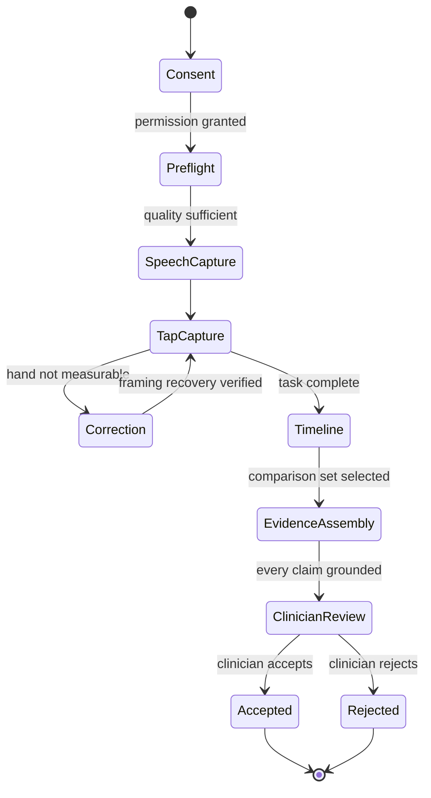
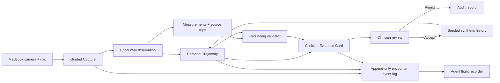

# Neurotrax demo-first architecture

## Scope

Neurotrax has exactly three capabilities:

1. Guided Capture
2. Personal Trajectory
3. Clinician Evidence Card

Consent, provenance, retention, an append-only event log, and human sign-off are
shared foundations. The flight recorder is a user-interface projection of those
events. These foundations are not separate features or autonomous agents.

This repository is an architecture skeleton. The application is not runnable
yet.

## Demo contract

The first implementation must communicate the complete agentic loop on one
continuous screen:

- keep the live camera visually dominant during capture;
- render a quiet agent flight recorder from real structured events;
- perform one truthful hand-framing intervention;
- load deterministic, clearly labeled synthetic personal history;
- include compatible encounters and visibly exclude one prompt-version
  mismatch;
- transition the camera tile into the newest timeline point;
- assemble one grounded evidence card;
- trace every summary claim to a measurement and source clip; and
- require a clinician to accept or reject the observation.

No interface may expose chain-of-thought, fabricate agent activity, or imply
that a placeholder measurement is clinically validated.

## Experience state model



The transition from `TapCapture` to `Timeline` should be spatially continuous:
the live camera tile shrinks into the latest encounter rather than disappearing
and reopening as a disconnected result page.

## Runtime data flow



The prototype may run in one local browser process. The arrows represent
logical contracts, not a requirement for separate services.

## Flight recorder

The flight recorder explains orchestration using structured, auditable events:

```text
consent.recorded
device.preflight.passed
task.capture.started
capture.quality.failed
agent.action.requested
action.outcome.verified
task.capture.resumed
encounter-observation.created
trajectory.compatibility.assessed
trajectory.comparison.completed
evidence-card.drafted
evidence-claim.grounded
human-review.pending
evidence.trace.opened
human-review.accepted
human-review.rejected
```

Each visible item should summarize an actual event and its outcome:

```text
Checking hand position
→ Finger-tapping requires full hand visibility
→ Framing correction requested
→ Visibility recovered

Selecting personal history
→ Four prior encounters found
→ Three compatible encounters included
→ One excluded: prompt-version mismatch
```

The event payload should carry timestamps, encounter and task IDs, component
version, status, and source references where applicable. It should not contain
private model reasoning.

## 1. Guided Capture

### Responsibility

Create one trustworthy encounter observation while making the only
participant-facing agent intervention.

### Inputs

- consent and retention scope;
- approved check-in protocol;
- MacBook camera and microphone;
- optional confirmed medication and context fields.

### Behavior

- request browser media permission and show visible recording state;
- run audio and video preflight;
- guide the speech and finger-tapping samples;
- monitor measurable hand framing during the tapping task;
- pause and request one concrete correction when the hand is not measurable;
- verify recovery before resuming;
- capture short local clips;
- attach device, task, and time metadata; and
- pass, request the bounded retry, or return `not measurable`.

### Output

A quality-controlled `EncounterObservation` plus structured encounter events.

### Boundary

Guided Capture does not diagnose, compare longitudinal history, recommend an
action, or interpret disease. It is the only capability allowed to interrupt
the participant.

## 2. Personal Trajectory

### Responsibility

Compare today's accepted-quality observation with compatible observations from
the same patient's personal history.

### Demo fixture

The hackathon build should ship a deterministic synthetic history with four
prior encounters:

- three that satisfy all compatibility rules; and
- one with a mismatched prompt version that is explicitly excluded.

The fixture guarantees a reliable longitudinal reveal and demonstrates that
the agent can decline invalid comparison data. The interface must label the
history as synthetic.

### Compatibility rules

- exact protocol, task, and prompt versions;
- compatible capture adapter;
- passing quality;
- known measurement version; and
- medication and context differences made visible.

### Output

A provisional `TrajectoryComparison` containing:

- included and excluded observations with explicit reasons;
- change estimate;
- uncertainty;
- comparability warnings; and
- current and prior evidence references.

### Boundary

Personal Trajectory cannot declare disease progression, infer a cause, generate
a treatment plan, or silently compare incompatible observations.

## 3. Clinician Evidence Card

### Responsibility

Compress the encounter and comparison into one inspectable clinician artifact.

### Card contents

- whether today's capture was usable;
- what provisionally changed and what remained stable;
- current value, compatible prior range, and uncertainty;
- context and comparability warnings;
- current and prior source clips;
- protocol, capture, measurement, and model provenance;
- a “Why this appeared” trace from claim to measurement to clip to event; and
- an `accepted` or `rejected` decision with an optional annotation.

### Grounding rule

The language model may draft constrained prose only from structured facts. A
grounding validator must reject any sentence that lacks a measurement and
source reference. Narrative generation cannot create measurements, alter
comparison membership, or make diagnostic or treatment claims.

### Boundary

The capability drafts and grounds. The clinician interprets and signs. Only
accepted observations enter longitudinal history.

## Responsibility split

```text
deterministic signal checks
  audio levels, clipping, voice activity, hand visibility, landmarks,
  tapping counts, task completion, and quality

agent orchestration
  proceed, pause, coach, retry, exclude an encounter, and assemble evidence

language model
  draft constrained clinician-facing prose from structured facts

grounding validator
  require every claim to cite a measurement and source reference

clinician
  interpret, annotate, accept, or reject
```

This division keeps the demonstration visibly agentic without pretending that a
language model is a validated signal-processing or clinical-decision system.

## Shared contracts

The first contract set contains:

- `EncounterManifest`
- `TaskInstance`
- `CaptureQuality`
- `EncounterObservation`
- `EncounterEvent`
- `TrajectoryComparison`
- `EvidenceClaim`
- `EvidenceCard`
- `ReviewDecision`

These are described in [packages/contracts](../packages/contracts/).

## Visual behavior

- The camera remains the primary surface during capture.
- Muted teal communicates active or complete states.
- Amber communicates correctable capture-quality problems.
- Red is reserved for unusable capture, not biomarker change.
- Recording boundaries distinguish `Recording this task` from `Not recording`.
- Captions make the flow understandable in a noisy demo environment.
- The interface avoids animated brains, scrolling tokens, clinical risk scores,
  and chatty agent personas.

## What is intentionally absent

- continuous analysis of the whole appointment;
- protocol marketplace;
- autonomous clinical reasoning;
- EHR write agent;
- background ambient agent;
- foundation model;
- forecasting service;
- disease classifier;
- patient alerting service; and
- separate microservice per signal modality.
