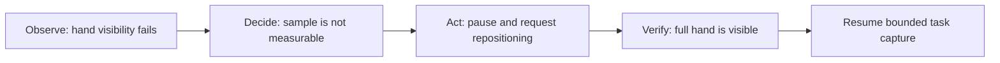

# Neurotrax demo experience

## Demo thesis

Neurotrax should feel like an encounter that explains itself:

> A brief, consented audiovisual check-in becomes a quality-controlled
> observation, a comparison with compatible personal history, and an
> inspectable clinician artifact.

The demo must show exactly three capabilities:

1. **Guided Capture** creates one trustworthy observation.
2. **Personal Trajectory** compares it with compatible synthetic history.
3. **Clinician Evidence Card** assembles grounded evidence for human review.

Consent, local retention, provenance, and clinician sign-off are foundations,
not additional agents. Neurotrax is a research prototype, not a diagnostic or
treatment system.

## One shell, three acts

Do not present separate dashboards or agent chat windows. Use one continuous
application shell whose visual center shifts as the encounter progresses.

```text
┌────────────────────────────────────────────────────────────────────┐
│ NEUROTRAX    Guided Capture → Personal Trajectory → Evidence Card │
├──────────────────────────────────────────────┬─────────────────────┤
│                                              │ AGENT ACTIVITY      │
│              LIVE CAMERA                    │                     │
│                  70%                         │         30%         │
│                                              │ observed            │
│      prompt / framing / waveform             │ acted               │
│                                              │ verified            │
├──────────────────────────────────────────────┴─────────────────────┤
│ LIVE CAPTURE · camera + mic active · recording this task · local  │
└────────────────────────────────────────────────────────────────────┘
```

During Guided Capture, the live camera occupies about 70% of the working area
and the Agent Activity rail occupies 30%. During trajectory and review, the
camera contracts into the current-encounter tile while the rail remains in the
same place. This visual continuity makes the final evidence trace back to the
moment it was captured.

## Visual language

- Use calm neutral surfaces and restrained clinical typography.
- Teal means active or verified.
- Amber means a correctable technical-quality issue.
- Red is reserved for unusable capture, permission loss, or hard failure. It
  never represents worsening health.
- Use a subtle pulse only for the currently running task.
- Never display animated brains, token streams, risk meters, or agents talking
  to one another.
- Keep captions visible so the demo is comprehensible in a noisy room.
- Keep `LIVE CAPTURE`, `SYNTHETIC HISTORY`, and fixture labels persistent.

The interface reveals decisions through state changes and evidence. It does not
display chain-of-thought or claim to expose private model reasoning.

## Exact 2:30 choreography

The stage path is timed to two minutes and thirty seconds, with a thirty-second
buffer for narration.

| Time | Capability | Presenter action | Neurotrax response | Visible audit event |
| --- | --- | --- | --- | --- |
| 0:00–0:10 | Guided Capture | Open the local app and select the synthetic demo identity. | Shows one-sentence consent and `No recording yet`. | No event emitted before consent |
| 0:10–0:20 | Guided Capture | Grant consent and camera/microphone permission. | Live preview appears; footer changes to `Camera + mic active · not recording`. | `consent.recorded` |
| 0:20–0:30 | Guided Capture | Sit centered and remain quiet. | Preflight checks framing, lighting, microphone level, and device metadata. | `device.preflight.passed` |
| 0:30–0:50 | Guided Capture | Read the short standardized speech prompt. | Waveform and countdown run only while the task records; speech quality verifies. | `task.capture.started`, `task.capture.completed` |
| 0:50–1:00 | Guided Capture | Move one hand partly outside the on-screen tapping guide. | Tapping instructions appear; capture begins. | `task.capture.started` |
| 1:00–1:12 | Guided Capture | Start tapping with the hand still partly outside the guide. | Capture pauses in amber and asks for repositioning. | `capture.quality.failed`, `agent.action.requested` |
| 1:12–1:25 | Guided Capture | Move the full hand into the guide and resume tapping. | Visibility is rechecked, recording resumes, and the task completes. | `action.outcome.verified`, `task.capture.resumed`, `task.capture.completed` |
| 1:25–1:35 | Guided Capture | Stop interacting. | Camera contracts into a current-encounter tile; capture closes locally. | `encounter-observation.created` |
| 1:35–1:50 | Personal Trajectory | Narrate that comparison is personal, not population-based. | Three compatible synthetic encounters enter the timeline; one dims and is excluded for a prompt-version mismatch. | `trajectory.compatibility.assessed` |
| 1:50–2:05 | Personal Trajectory | Point to the inclusion rule and uncertainty. | Two compact trends animate from prior observations to today; results remain marked `provisional`. | `trajectory.comparison.completed` |
| 2:05–2:18 | Evidence Card | Let the card assemble. | Quality, change, stability, context, and uncertainty sections appear only as grounded claims pass. | `evidence-card.drafted`, `evidence-claim.grounded`, `human-review.pending` |
| 2:18–2:25 | Evidence Card | Click one summary sentence. | The supporting measurement highlights and the exact current/prior clip ranges open in a trace drawer. | `evidence.trace.opened` |
| 2:25–2:30 | Evidence Card | Choose `Accept into history` or `Reject`. | Decision is recorded; only acceptance updates the synthetic longitudinal history. | `human-review.accepted` or `human-review.rejected` |

The demo ends on the reviewed Evidence Card, not an engineering console.

## The essential agentic moment

The hand-framing correction is the hero interaction. It must demonstrate that
the system does more than run inference after recording:



Use a deterministic landmark-and-region rule rather than a generative judgment.
The rule, threshold, task version, and result belong in the audit log. Permit
one correction. If recovery does not pass, record `not measurable`; do not force
a successful result for the presentation.

## Honest agent legibility

The Agent Activity rail is a filtered view of an append-only event log. A
user-facing message may summarize an event, but it may not exist without the
underlying structured record.

Each event has at least:

```text
event ID
encounter ID
timestamp
capability
event type
input references
result or action
rule/model version
status
```

The rail should answer:

- What did Neurotrax observe?
- Did that observation change the workflow?
- Was the result verified?
- Which evidence and version produced the displayed result?

It should not answer “what was the model secretly thinking?” Prompts, hidden
reasoning, and decorative inter-agent dialogue are excluded.

## Deterministic synthetic history

The current encounter should be live whenever hardware permits. Longitudinal
history should be a checked-in, deterministic fixture for a synthetic identity:

- three accepted observations that match protocol, task, prompt, capture
  adapter, quality, and measurement versions;
- one observation with a deliberate prompt-version mismatch;
- locally available prior clip fixtures;
- fixed context and uncertainty fields;
- no protected health information.

The timeline must label every prior point `SYNTHETIC`. The exclusion animation
is useful only because it demonstrates a real compatibility rule; it must not
imply the agent rejected a patient or made a clinical judgment.

## The final Evidence Card

The card is one screen, optimized to answer five questions:

1. Was today's capture usable?
2. What changed relative to compatible personal history?
3. What remained stable?
4. What evidence supports each statement?
5. How uncertain and comparable is the result?

A safe demo headline is:

> **One provisional technical change; one stable observation**

Supporting copy may describe measured direction, range, or quality. It must also
state:

> No disease-progression, diagnostic, causal, or treatment inference was made.

The card includes:

- capture quality and the recovered hand-framing event;
- current values and compatible prior ranges;
- two small personal-trajectory sparklines;
- uncertainty beside every comparison;
- context and compatibility warnings;
- current and prior clip controls;
- `Accept into history`, `Reject`, and optional annotation controls.

## Claim-to-clip interaction

Every narrative claim is a selectable evidence object. Selecting it:

1. highlights the exact structured measurement;
2. opens the current source clip at the supporting time range;
3. lists the prior observation and clip references used for comparison;
4. exposes capture quality, context, and uncertainty;
5. shows protocol, processor, algorithm, and card-generator versions.

The relationship is always reversible:

```text
narrative claim
  -> structured measurement
  -> task and clip time range
  -> quality and compatibility evidence
  -> versioned source events
```

If grounding fails, withhold the claim. Never display prose and attach an
unrelated clip merely to make it look cited.

## Privacy and recording labels

The footer is persistent and must distinguish device access from recording:

```text
Camera + mic off · not recording
Camera + mic active · not recording
Camera + mic active · recording speech task · stored locally
Camera + mic active · recording tapping task · stored locally
Capture complete · camera + mic off · local retention pending review
```

Additional rules:

- no recording before consent;
- derive every live or fallback label from the artifact's machine-readable
  `captureMode`;
- no continuous or ambient recording;
- only the active approved task is captured;
- a stop control is always visible;
- local deletion is always available;
- no upload occurs by default;
- synthetic and fixture data are unmissably labeled;
- withdrawal stops capture and blocks downstream processing.

## Stage reliability and fallback ladder

The demo should be deterministic without pretending that fixtures are live.

### Before the presentation

1. Run the same browser, device, resolution, and lighting used in rehearsal.
2. Verify camera and microphone permission before screen sharing.
3. Warm the landmark detector and run the full path once.
4. Cache the application, models, history, and clips locally.
5. Disable notifications and bandwidth-dependent services.
6. Confirm the framing guide works at the presenter's seat and distance.

### Runtime fallback ladder

1. **Preferred:** live camera and microphone plus deterministic synthetic
   history.
2. **Media-processing fallback:** live preview and local recording with
   prerecorded, version-matched processor outputs. Show
   `CACHED PROCESSOR OUTPUT`.
3. **Hardware fallback:** prerecorded fixture encounter. Show
   `FIXTURE PLAYBACK — NOT LIVE CAPTURE` throughout capture and review.
4. **Last resort:** a local, prerecorded screen walkthrough whose chrome says
   `RECORDED DEMO`.

If the hand-framing event is injected in a fallback path, its event type begins
with `fixture.` and the visible fixture label remains on screen. The fallback
may preserve the choreography but must never be represented as a live agent
observation.

## Demo acceptance criteria

The build is demo-ready when:

- the complete path runs locally in under three minutes;
- the camera remains the primary surface during capture;
- every rail entry maps to a structured audit event;
- the hand-framing intervention pauses, coaches, verifies, and resumes;
- one incompatible synthetic observation is visibly excluded by rule;
- every Evidence Card claim resolves to measurement and clip references;
- consent, recording, retention, and fixture state are always legible;
- `not measurable` is an honest reachable outcome;
- the system makes no diagnosis, progression claim, or treatment suggestion;
- acceptance and rejection produce different, inspectable history outcomes.
