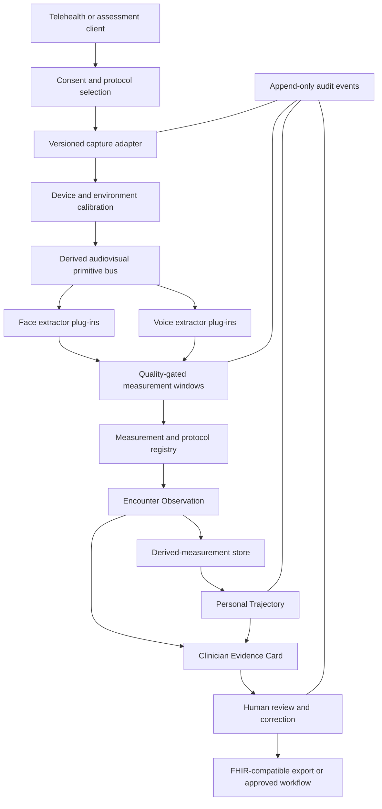

# PhenoMetric platform vision

## Purpose

This document defines the long-term direction for PhenoMetric, which began as
the NeuroTrax neurological hackathon demonstration.

PhenoMetric is intended to become a reusable clinical observability layer for
telehealth: a system that converts consented audiovisual signals into
quality-controlled, versioned, longitudinal measurements and presents those
measurements as inspectable evidence for a clinician.

It is not a commitment to diagnose every condition that correlates with a face
or voice feature. It is a framework for developing narrow, testable,
condition-specific contexts of use on a shared technical and governance
foundation.

## Core proposition

Video visits contain observable information that is rarely measured
systematically. Examples include:

- facial symmetry, range, velocity, tremor, and fatigability;
- eyelid position, aperture, closure, blink, and gaze behavior;
- mouth aperture, lip excursion, jaw movement, and visible articulation;
- speech initiation, timing, pause structure, rhythm, and turn-taking;
- pitch, intensity, phonation stability, spectral characteristics, and
  intelligibility;
- breath support, speech breathlessness, cough, and respiratory timing; and
- coordination among facial motion, articulation, voice, and task context.

The platform should turn selected observations into durable measurement
records while keeping the original clinical meaning bounded:

```text
observable signal ≠ validated measurement
validated measurement ≠ clinical interpretation
clinical interpretation ≠ clinical action
```

Each transition requires its own evidence, responsibility, and review.

## Product boundary

The product has exactly three capabilities.

### Ambient Capture

Ambient Capture acquires and qualifies audiovisual evidence. It owns:

- consent and intended-use confirmation;
- device and environment calibration;
- ambient and prompted measurement contexts;
- independent modality quality state;
- measurement-window selection;
- deterministic feature extraction;
- reason-coded abstention;
- capture-adapter and protocol provenance; and
- the structured encounter observation.

### Personal Trajectory

Personal Trajectory determines whether prior observations are comparable and
computes transparent within-person reference statistics. It owns:

- participant and review-status matching;
- task, context, protocol, and algorithm compatibility;
- device and environmental confound tolerances;
- medication-state and other clinical-context compatibility where required;
- exact inclusion and exclusion reasons;
- robust personal-reference statistics;
- uncertainty and minimum-data requirements; and
- provisional change descriptions within the approved claim boundary.

### Clinician Evidence Card

The Clinician Evidence Card is the human-review interface. It owns:

- quantitative encounter and trajectory presentation;
- evidence-to-source traceability;
- bounded narrative drafting;
- uncertainty and missingness display;
- clinician correction, approval, or dismissal;
- copy or interoperable export; and
- the audit event for human disposition.

No component may both recommend and execute a consequential clinical action.

## Shared platform versus clinical protocol packs

The shared platform should provide the sensing, contracts, trajectory,
evidence, privacy, and governance infrastructure. Clinical meaning belongs in
separately versioned protocol packs.

A protocol pack should define:

| Field | Requirement |
| --- | --- |
| `intendedUse` | Measurement, monitoring, screening, decision support, or another explicit use |
| `targetPopulation` | Inclusion, exclusion, age, language, diagnosis, severity, and care setting |
| `operator` | Patient, caregiver, generalist, specialist, researcher, or supervised combination |
| `captureContexts` | Natural conversation and any standardized prompted microtasks |
| `requiredModalities` | Face, voice, or both; neither modality is implicitly mandatory |
| `measurements` | Exact codes, units, algorithms, and minimum evidence |
| `qualityContract` | Calibration, framing, SNR, pose, duration, coverage, and abstention rules |
| `clinicalConfounds` | Medication timing, fatigue, infection, recent procedure, language, and other relevant state |
| `referenceStandard` | Clinician scale, laboratory result, imaging, physiology, or adjudicated outcome |
| `uncertaintyModel` | Repeatability, measurement error, confidence interval, and minimum detectable change |
| `validatedClaim` | Exact permitted output language and prohibited extrapolations |
| `humanWorkflow` | Who reviews the result and what non-autonomous next step it supports |
| `evidenceVersion` | Study, dataset, subgroup, and regulatory evidence supporting the pack |

A new medical condition is not a new platform capability. It is a new protocol
pack with an independent validation burden.

## Capture modes

### Ambient observation

Ambient windows reduce patient burden and can measure behavior during ordinary
conversation. They are useful for repeated low-friction collection but are
vulnerable to topic, turn-taking, emotion, clinician behavior, and visit-length
confounding.

### Prompted microtasks

Short tasks create more comparable contexts. Candidate tasks include:

- neutral face, smile, brow raise, eye closure, cheek inflation, and lip purse;
- sustained upward or lateral gaze;
- repeated blink or facial-fatigue sequences;
- sustained vowel;
- standardized reading;
- counting on one breath;
- repeated syllables such as `pa-ta-ka`;
- picture description or story recall; and
- condition-specific rehabilitation movements.

Prompted tasks must remain optional at the platform level and required only by
a specific protocol pack.

### Hybrid encounters

The preferred long-term workflow combines ambient collection with one or two
brief microtasks selected by the care context. The encounter should remain
clinically usable when a modality or task fails.

## Measurement domains

### Facial geometry and morphology

Candidate measurements include:

- left-right asymmetry by facial region;
- inter-landmark distances and ratios;
- static craniofacial morphology;
- eyelid margin and aperture;
- ptosis and lid retraction;
- oral aperture and lip excursion;
- head pose and alignment; and
- change relative to a personal neutral reference.

Static morphology is particularly sensitive personal data. It must never be
repurposed for identity, ancestry, attractiveness, emotion, or other unrelated
inference.

### Facial dynamics

Candidate measurements include:

- displacement, velocity, acceleration, smoothness, and range;
- onset, offset, symmetry, and coordination of prompted expressions;
- tremor or involuntary movement;
- blink dynamics;
- gaze stability and fatigability;
- visible articulation and lip-jaw coordination; and
- within-task deterioration or recovery.

### Voice and speech acoustics

Candidate measurements include:

- pitch, intensity, jitter, shimmer, harmonics, and spectral tilt;
- formants and articulatory-acoustic coordination;
- phonation breaks and voice-quality instability;
- speech and articulation rate;
- voiced fraction and pause distribution;
- intelligibility and automatic-speech-recognition error under an approved
  language model;
- respiratory timing, breath groups, and counting performance; and
- cough count and acoustics where explicitly included.

### Language and interaction

Language features may support selected cognitive or behavioral contexts, but
they require a separate consent and privacy boundary from content-free
acoustics. Candidate measurements include:

- lexical diversity and word retrieval;
- syntactic complexity;
- semantic coherence;
- verbal fluency;
- turn-taking and response latency; and
- task adherence.

Conversation content must remain untrusted input and may not instruct the
system or silently enter a new clinical inference.

## Clinical portfolio

### High-fit measurement and monitoring opportunities

These applications have relatively direct relationships between the observable
signal and the clinical function:

- facial nerve palsy grading and rehabilitation;
- myasthenia gravis ptosis, facial, vocal, and respiratory fatigability;
- ALS and other bulbar neuromuscular monitoring;
- Parkinsonism and movement-disorder face and speech function;
- laryngology and vocal-function follow-up;
- thyroid eye disease and oculoplastic measurement;
- systemic-sclerosis oral-aperture monitoring; and
- head-and-neck postoperative or therapy rehabilitation.

### Promising referral-enrichment and screening research

These applications may support a clinician's decision to pursue definitive
testing but generally should not produce a stand-alone diagnosis:

- acromegaly and selected endocrine morphologic syndromes;
- mild cognitive impairment and dementia;
- laryngeal disease;
- selected rare genetic syndromes; and
- autism and developmental assessment under specialist supervision.

### Higher-confound, higher-governance research

These may eventually support monitoring but should not be early autonomous
claims:

- depression, bipolar disorder, anxiety, and psychosis;
- pain, fatigue, and frailty;
- heart-failure decompensation;
- asthma and COPD exacerbation;
- infection or cough-based disease classification; and
- broad population-risk prediction.

These signals are nonspecific, culturally and behaviorally sensitive, and
susceptible to medication, sleep, stress, language, environment, and device
effects.

### Explicitly unsuitable general claims

The platform should not pursue:

- universal health or disease scores;
- covert analysis of routine calls without purpose-specific consent;
- emotion, truthfulness, intent, capacity, or pain-validity classification;
- diagnosis based only on a facial resemblance or vocal correlation;
- emergency disposition without a separately validated safety system;
- demographic or identity inference unrelated to the intended clinical use;
- automatic treatment, prescribing, ordering, or patient messaging; or
- transfer of evidence from one condition, age group, language, or device
  population to another without validation.

## Evidence ladder

### 1. Technical verification

Show that software and hardware perform as specified:

- deterministic calculation and versioning;
- correct units and timing;
- no mixed algorithm versions;
- reliable quality and abstention behavior;
- known device and browser compatibility; and
- secure handling and deletion of raw media.

### 2. Analytical validation

Show that measurements accurately and repeatably quantify the target signal:

- test-retest and inter-device reliability;
- comparison with instrumented or expert annotation;
- sensitivity to pose, lighting, noise, camera, and microphone;
- minimum measurable and minimum detectable change;
- missingness and failure-mode analysis; and
- subgroup performance.

### 3. Clinical validation

Show that the measurement relates to a clinically meaningful characteristic in
the intended population:

- prospectively defined population and reference standard;
- external and multisite validation;
- clinically relevant operating thresholds;
- calibration, sensitivity, specificity, predictive value, and uncertainty;
- incremental value over existing care; and
- analysis of confounders and subgroup equity.

### 4. Clinical utility

Show that using the result improves an actual workflow or outcome:

- clinician comprehension and trust;
- patient burden and accessibility;
- time to appropriate evaluation;
- monitoring sensitivity;
- documentation quality;
- alert and false-positive burden; and
- effect on care decisions or outcomes.

### 5. Production governance

Maintain safety after deployment:

- model, protocol, and data version registry;
- change control and rollback;
- drift and subgroup monitoring;
- cybersecurity and incident response;
- audit and access control;
- complaint and adverse-event handling where applicable; and
- periodic revalidation.

## Research and production data paths

### Production direction

The production direction remains:

> Ephemeral media, durable measurements.

Raw audio and video should be processed locally where feasible and discarded
when the encounter ends. Durable records should contain only the minimum
derived information necessary for the approved context of use.

### Research requirement

New clinical measurements cannot be validated without source evidence. A
separate research environment may retain raw media only when all of the
following are true:

- the participant has given explicit research consent;
- institutional and regulatory review is complete where applicable;
- the purpose, retention period, access, and future use are specific;
- media is encrypted and access-controlled;
- research identity is separated from operational identity;
- annotation and export are audited;
- deletion and withdrawal procedures are defined; and
- no retained research media silently becomes production data.

The current repository implements only the ephemeral demonstration path.

## Longitudinal design

Personal Trajectory should prefer individual reference distributions over a
single universal normal range. It should:

- establish repeated baselines rather than treating Visit 1 as ground truth;
- preserve raw per-visit derived measurements as well as robust summaries;
- model expected measurement error and biological variability;
- apply minimum-data requirements before describing change;
- distinguish step change, trend, fluctuation, and recovery;
- show missing or incompatible encounters rather than hiding them;
- account for protocol, algorithm, device, medication, and context changes; and
- avoid equating a measurement trend with disease progression.

Algorithm upgrades require an explicit migration strategy. Options include
dual-running old and new algorithms, reprocessing retained research media,
bridging studies, or starting a new personal baseline.

## Human and AI responsibilities

Deterministic or clinically validated algorithms should own measurements.
Generative models may:

- organize already selected facts;
- produce bounded, schema-constrained draft language;
- improve generalist readability; and
- help navigate an evidence trace.

Generative models may not:

- create or alter measurements;
- choose a diagnosis;
- hide abstention or uncertainty;
- infer a clinical claim absent from the protocol pack;
- change the comparison set;
- sign or approve the report; or
- execute a clinical action.

Every generated statement must resolve to structured evidence and remain
subject to human review.

## Technical target architecture



## Recommended sequence

### Foundation

1. Align documentation and product language.
2. Define `ClinicalProtocolPack` and measurement-registry contracts.
3. Make validation status and uncertainty structured rather than placeholders.
4. Reconcile legacy fixtures and current implementation documentation.

### Measurement engine

1. Introduce extractor plug-ins with explicit input and output contracts.
2. Add facial symmetry, eyelid, oral-motor, and dynamic-task measurements.
3. Add clinical-grade voice-quality and articulation measurements.
4. Add patient-versus-clinician speaker attribution.
5. Add configurable ambient and prompted contexts.
6. Add repeatability-based uncertainty and device calibration.

### Longitudinal platform

1. Add a derived-measurement store with identity, authorization, audit, and
   retention policy.
2. Connect the existing trajectory engine to accepted observations.
3. Establish multi-visit baselines and minimum-data rules.
4. Add protocol and algorithm migration handling.
5. Present change with compatible-history and missingness explanations.

### First protocol pack

Choose one narrow intended use. The recommended evaluation order is:

1. facial palsy rehabilitation measurement;
2. myasthenia gravis face-and-voice monitoring;
3. laryngology voice-function follow-up; and
4. acromegaly referral-enrichment research.

Selection should be based on clinical partner access, reference-standard
quality, patient need, data feasibility, regulatory path, and ability to run a
prospective multisite study—not market size alone.

### Clinical integration

1. Add clinician correction and adjudication.
2. Add FHIR-compatible observation and document export.
3. Integrate into an existing telehealth workflow.
4. Complete human-factors, privacy, cybersecurity, and regulatory work.
5. Demonstrate clinical utility before expanding the claim.

### Portfolio expansion

Add new protocol packs only after the shared foundation is stable and the new
context has its own evidence and governance owner.

## Near-term success criteria

Before describing PhenoMetric as a platform ready for clinical research, it
should be possible to demonstrate:

- repeatable measurements across multiple sessions and supported devices;
- condition-independent capture and protocol-pack routing;
- structured uncertainty and validation state for every metric;
- multi-visit Personal Trajectory in the live application;
- a research-consent and source-media governance design;
- clinician correction and evidence adjudication;
- documented subgroup and failure-mode testing;
- secure derived-measurement persistence; and
- one approved prospective protocol with a clinical partner and reference
  standard.

## Decision principle

When choosing between breadth and evidence, choose evidence.

The platform becomes broad by reusing trustworthy infrastructure across many
narrowly validated contexts. It does not become trustworthy by attaching many
disease labels to the same unvalidated signal.
