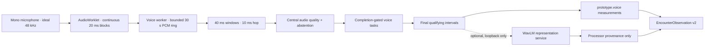

# Voice Foundation

Voice Foundation is PhenoMetric’s microphone-only engineering protocol. It
creates quality-aware, task-specific acoustic measurements without recording
audio, producing a transcript, interpreting speech content, or depending on a
remote model.

It is a research prototype, not a medical device or validated voice biomarker
system.

## Capture and analysis path



The browser requests one channel at an ideal 48 kHz with echo cancellation,
noise suppression, and automatic gain control disabled. Actual sample rate,
channel count, and browser-processing state are recorded without device IDs,
labels, or group IDs.

The `AudioWorklet` emits continuous 20 ms Float32 blocks through a transferable
`MessageChannel`. Every block has a capture epoch, monotonic sequence,
acquisition time, and absolute sample index. Returned buffers are reused. The
worker keeps at most 30 seconds of PCM, never synthesizes a missing block as
silence, and resets its analysis boundary across a discontinuity.

DSP runs on 40 ms windows every 10 ms. Independent pitch estimators cover
50–700 Hz, with agreement and octave-ambiguity checks. A third periodicity
check resolves clean adjacent-lag/octave cases; uncertain signals abstain from
F0 rather than being mislabeled as silence. Formant candidates use pre-emphasis
and 16 kHz LPC analysis before plausibility filtering. Syllabic and DDK nuclei
are amplitude/spectral-flux estimates, not phoneme recognition.

`VoiceSignalFrameV1` is the only per-window message leaving the worker. It
contains compact timing, voicing, F0/periodicity, named acoustic primitives,
quality reasons, and processor provenance. It contains no PCM, waveform,
spectral array, pitch-cycle boundary, cepstrum, MFCC, formant track,
spectrogram, transcript, embedding, voiceprint, or microphone identifier.

## Quality contract

One pure evaluator is shared by live gating and extraction. Defaults are:

- sample rate at least 44.1 kHz for fine acoustic measurements;
- no block gap over 40 ms;
- no more than 5% lost blocks in the current two-second window;
- SNR at least 15 dB generally and 20 dB for perturbation/voice-quality
  measurements;
- clipped samples no greater than 1%;
- absolute DC offset no greater than 0.02; and
- at least two seconds of quiet calibration with 80% usable coverage.

Reasons include `microphone-unavailable`, `audio-worklet-unavailable`,
`voice-worker-unavailable`, `audio-frame-gap`,
`sample-rate-below-minimum`, `audio-processing-enabled`,
`snr-below-minimum`, `signal-too-quiet`, `audio-clipping`, `dc-offset`, and
`task-not-observed`.

If the browser leaves echo cancellation, noise suppression, or automatic gain
control enabled, timing and coverage measurements may continue. CPPS, HNR,
jitter, shimmer, formants, and other fine amplitude/periodicity measurements
abstain independently.

## Completion-gated task battery

After two seconds of quiet calibration and 1.5 seconds of usable natural
speech, the protocol requires:

1. two sustained `/a/` trials, each with three seconds of continuous voiced
   evidence and at least 80% reliable periodicity coverage;
2. four seconds of usable standardized reading;
3. four seconds of rapid `/pa-ta-ka/` with at least six estimated syllabic
   nuclei; and
4. eight seconds of usable spontaneous response, allowing brief natural
   pauses.

No task advances from time alone. Quality failure resets the current
qualifying interval but leaves earlier completed tasks intact. Corrective help
appears after twelve seconds. There is no timeout or skip. Ending the
assessment releases the microphone and creates no observation or report.

Only the final successful interval for each task reaches the conductor. The
system does not claim reading accuracy or phoneme-sequence correctness.

## Measurements

Shared measurement types, where supported:

- `prototype.voice.f0.median`
- `prototype.voice.f0.variability`
- `prototype.voice.cpps`
- `prototype.voice.hnr`
- `prototype.voice.intensity.variability`
- `prototype.voice.voiced_fraction`
- `prototype.voice.pause_rate`
- `prototype.voice.pause_duration.median`
- `prototype.voice.speech_run_duration.median`
- `prototype.voice.syllabic_rate_estimate`

Sustained-vowel types:

- `prototype.voice.jitter.local`
- `prototype.voice.shimmer.local`
- `prototype.voice.phonation_break_fraction`
- `prototype.voice.formant.f1_median`
- `prototype.voice.formant.f2_median`

Rapid-syllable types:

- `prototype.voice.ddk.rate`
- `prototype.voice.ddk.interval_variability`

Spontaneous-response type:

- `prototype.voice.onset_latency`

Each value carries its task context, algorithm version, processor reference,
source window, confounds, engineering reliability, and uncertainty. Within-task
uncertainty uses median absolute deviation across valid 500 ms subwindows;
repeated vowel measurements use between-trial MAD. Non-repeatable onset latency
is explicitly marked `not-estimated`. Reliability is not a clinical
probability.

The evidence layer prefers sustained-vowel CPPS, then DDK interval variability,
then spontaneous-speech pause rate. It sends one voice outcome in Voice
Foundation and one face outcome in Facial Foundation.

## Optional WavLM representation service

`services/voice-inference` is a Python 3.11, `uv`-managed FastAPI sidecar bound
to loopback. It is disabled unless explicitly configured. The only registered
adapter is:

- model: `microsoft/wavlm-large`;
- revision: `c1423ed94bb01d80a3f5ce5bc39f6026a0f4828c`;
- verified weight SHA-256:
  `fdee460e529396ddb2f8c8e8ce0ad74cfb747b726bc6f612e666c7c1e1963c9d`;
- requested layers: 6, 12, 18, and 24.

`GET /v1/health` reports readiness and provenance.
`POST /v1/voice/representations` accepts only finite, mono 16 kHz Float32 PCM
lasting 1.5–30 seconds with versioned request, epoch, window, and task
references. Path and URL inputs are forbidden. The response contains only
mean/std pooling per requested layer and processor provenance.

The browser adapter remains off unless its loopback endpoint is supplied
explicitly when starting the demo:

```bash
VITE_VOICE_REPRESENTATION_ENDPOINT=http://127.0.0.1:8765/v1/voice/representations pnpm dev
```

Request bodies are not logged, audio is not written to disk, and embeddings
are not retained. The browser aborts requests on reset or media release.
Unavailability produces a representation-only abstention and cannot block DSP
measurements or reporting. Embeddings do not become measurements, evidence
facts, diagnostics, or trajectory data.

## Explicit deferrals

This milestone does not add ASR, transcripts, reading accuracy, phoneme
recognition, HeAR, Omnilingual W2V, diarization, speaker recognition,
voiceprints, retained research audio, clinical scores, diagnostic claims,
FHIR/EHR integration, or face–voice synchronization and fusion. Each requires
separate design and validation.
